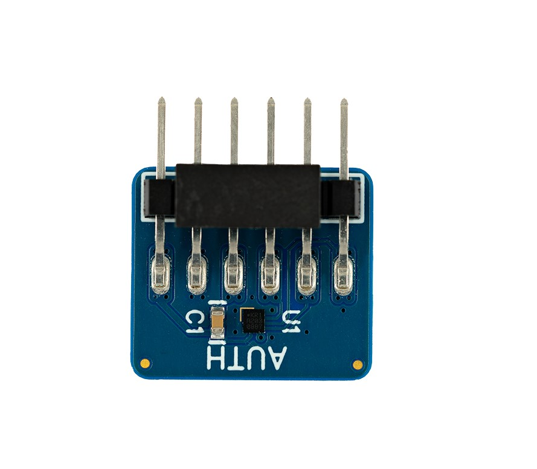
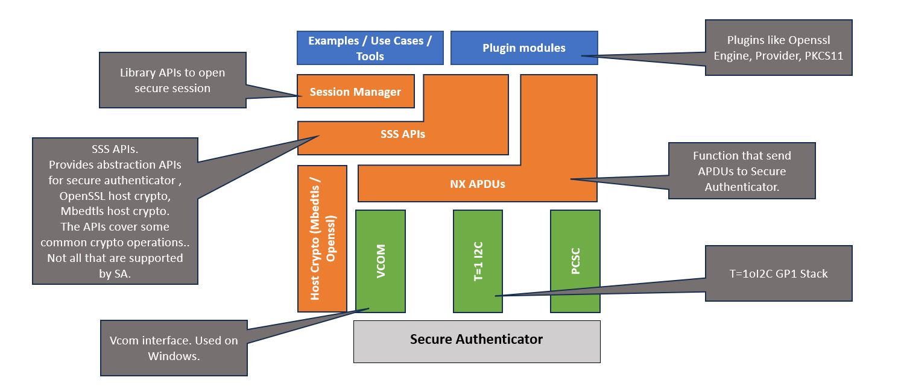

# NX Middleware for EdgeLock A30 and NTAG-X-DNA Secure Authenticator

EdgeLock A30 and NTAG-X-DNA are secure authentication ICs for IoT platforms, electronic accessories and consumable devices
such as home electronic devices, mobile accessories and medical supplies.
EdgeLock A30 and NTAG-X-DNA supports on-chip ECC key generation to make sure that private keys are never exposed outside
the IC. It performs cryptographic operations for security critical communication and control functions. EdgeLock A30 and NTAG-X-DNA are
Common Criteria EAL 6+ security certified with AVA_VAN.5 on product level and supports a generic

<p align=left>

</p>

Crypto API providing AES, ECDSA, ECDH, SHA, HMAC and HKDF cryptographic functionality.
- Asymmetric cryptography features support 256-bit ECC over the NIST P-256 and brainpool P256r1 curves.
- Symmetric cryptography features support both AES-128 and AES-256.
- PKI-based mutual authentication based on the Sigma-I protocol.
- Symmetric three pass Mutual Authentication protocol compatible with NTAG42x and MIFARE DesFire EV2, DesFire EV3 and DesFire Light.
- Secure messaging channel using either AES-128 or AES-256 session encryption/decryption and MAC.

The Common Criteria security certification ensures that the IC security measures and protection mechanisms
have been evaluated against sophisticated noninvasive and invasive attack scenarios.
- A30 supports an I2C contact interface and has two additional 2 GPIOs.
- A30 supports a low-power design, and consumes only 5 μA at Deep-Power-Down mode when an external VDD is supplied.


NX Middleware here provides the necessary interfaces, examples, demos for A30 Secure Authenticator (SA) IC.
Following diagram shows different modules that are part of NX Middleware.

<p align=left>

</p>


````console
NOTE:
  1) It is recommended to use the latest version of this NX middleware software.
  2) VCOM and PC/SC interfaces (https://pcscworkgroup.com/) are provided for quick evaluation of the Secure authenticator examples and should not be deployed in a product.
````

To contact NXP or to report issues, please use [**Support | NXP**](https://www.nxp.com/support/support:SUPPORTHOME)


Refer [**NX Middleware**](doc/stack/readme.md) for more details on the middleware.


## Getting Started

Refer the following sections to build NX Middleware and run demos.

For Linux, refer [**Getting started on Linux**](doc/linux/readme.md)

For Windows, refer [**Getting Started on Windows**](doc/windows/readme.md)

For MCU Projects, refer [**Getting Started on MCUs Using Standalone MCUXpresso Projects**](doc/mcu_projects/readme.md)

For MCU cmake build, refer [**Getting Started on MCU cmake build**](doc/mcu_cmake/readme.md)

## Folder Structure

| File/Folder        | Content                                                                 |
| ------------------ | ------------------------------------------------------------------------|
| binaries           | Pre built binaries, session certificates and keys for testing           |
| boards             | Platform porting specific files                                         |
| demos              | Examples / Use cases / Access manager                                   |
| doc                | Documentation                                                           |
| ext                | Openssl and PKCS11 dependencies required to build / run MW demos        |
| lib                | Session Manager Code, SSS APIs, NX APIs to use NX SA                    |
| mcu_sdk            | Files for cloning and building from MCU SDK                             |
| mcux_project       | Standalone MCUXpresso projects for various supported MCUs               |
| plugin             | Standard plugins like OpenSSL Engine, OpenSSL provider, psa, pkcs11     |
| scripts            | Scripts for building the MW                                             |
| tools              | Temporary executables                                                   |
| ChangeLog.md       | Change Log file                                                         |
| CMakeLists.txt     | Root Cmake file                                                         |
| LICENSE.txt        | License                                                                 |
| README.md          | Readme document                                                         |
| SCR.txt            | Software Content Register                                               |

## Useful Links

OpenSSL Provider - [**OpenSSL Provider**](plugin/openssl_provider/readme.md)

OpenSSL Engine - [**OpenSSL Engine**](plugin/openssl/readme.md)

Platform Security Architecture - [**Platform Security Architecture**](plugin/psa/README.md)

Access Manager for Linux - [**Access Manager**](demos/linux/nx_access_manager/readme.md)

Command line tool - [**NX CLI Tool**](demos/nx/nx_cli_tool/readme.md)
