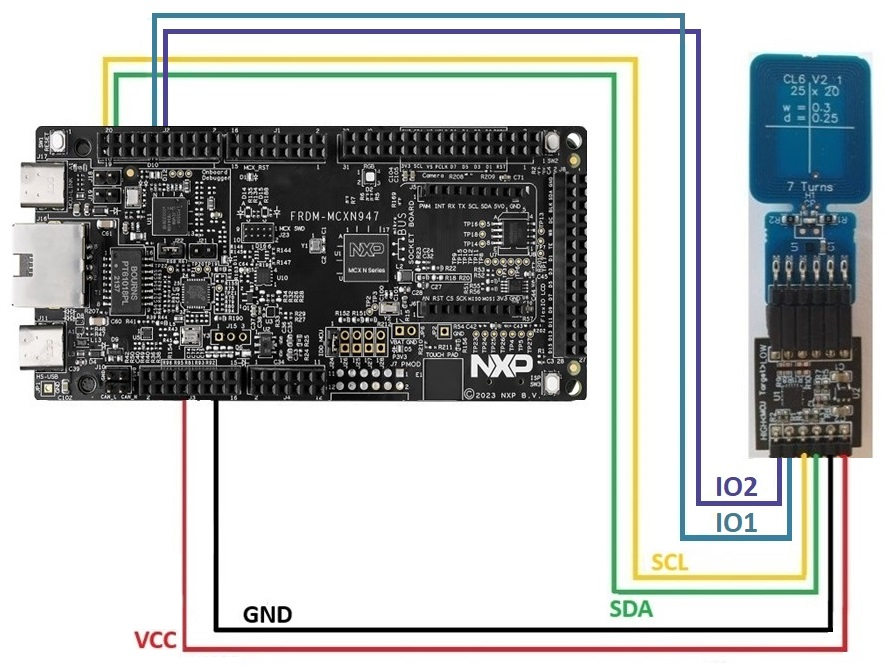
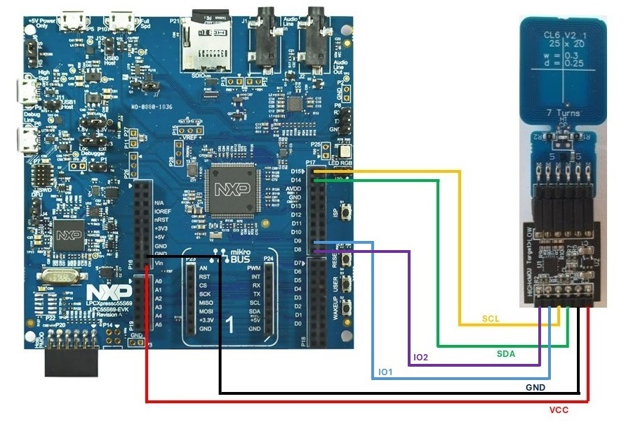

# Supported Platforms

Secure Authenticator MW is designed to run on several platforms including Windows, Linux and several MCUs including MCUXN947, LPC55S69 and MCXA153.

This folder contains the platform specific files and driver files

## Build with Linux

To use the Secure Authenticator MW with Raspberry Pi, Refer [**Linux Build**](../doc/linux/readme.md).

## Build with Windows

To use the Secure Authenticator MW with Windows PC, Refer [**Windows Build**](../doc/windows/readme.md).

## Build with MCUX Platforms

To build the Secure Authenticator MW using MCUXpresso for supported MCUs, Refer [**MCUXpresso Build**](../doc/mcu_projects/readme.md).

To build the Secure Authenticator MW using CMake build for supported MCUs, Refer [**CMake Build**](../doc/mcu_cmake/readme.md).

## Secure Authenticator Connections with Host MCUs

### MCXN947 Pin Diagram

### LPC55S69 Pin Diagram

### MCXA153 Pin Diagram

