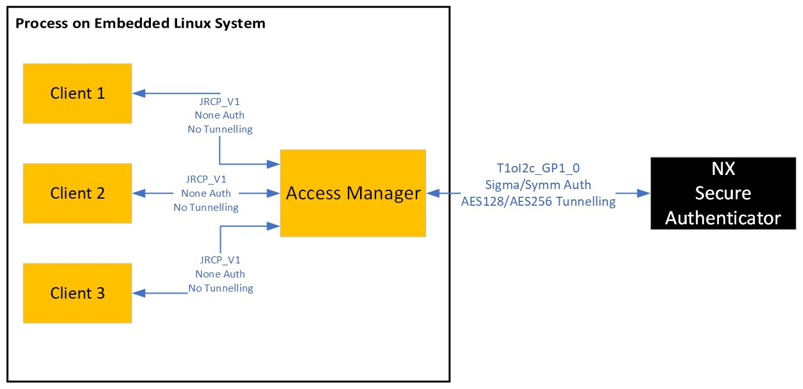
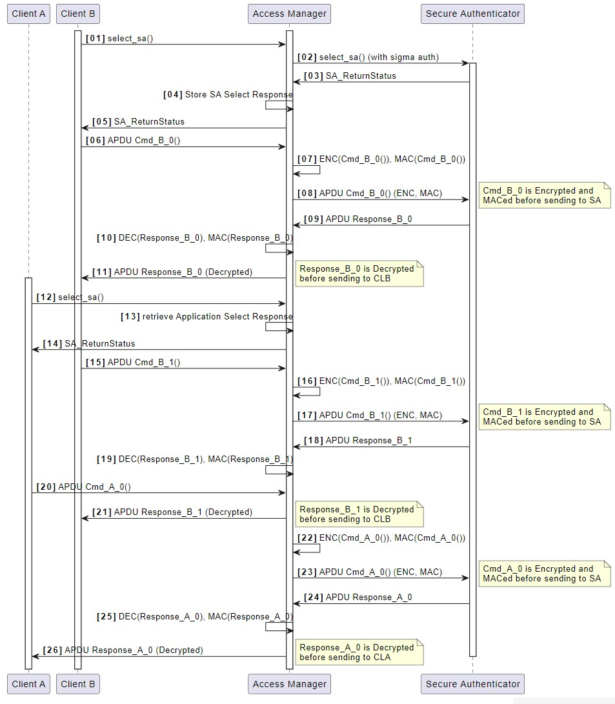

# Access Manager

The Access Manager supports concurrent access from multiple processes to
NX Secure Authenticator. Currently, Access Manager runs only in Linux
environment but any process can connect to it via remote IP address. The
Access Manager can establish a connection to the NX Secure Authenticator
(SA) either as a plain connection, symmetric authentication or SIGMA_I
authentication. Client processes can connect over the JRCP_V1_AM
protocol to the Access Manager.

The following figure illustrates that the Access Manager is an
independent process providing indirect access to the NX Secure
Authenticator IC for client processes.

<p align=left>

</p>

The following sequence diagram illustrates two processes connecting
through the Access Manager to the Secure Element.

<p align=left>

</p>


## Supported Platforms

Access Manager can be used on linux and raspbian platforms with
`NXMW_SMCOM` as **VCOM** or **T1oI2C_GP1_0**.


## Build

Run the commands below to build access manager for NX secure authenticator. For details, refer [**Linux build**](../../../doc/linux/readme.md).

```console
git clone ssh://git@bitbucket.sw.nxp.com/kmw/nxmw-github.git
cd nx-mw-top/scripts
python create_cmake_projects.py
cd ../../nx-mw-top_build/raspbian_native_nx_t1oi2c
cmake -DNXMW_Auth=SYMM_Auth -DNXMW_SMCOM=T1oI2C_GP1_0 -DNXMW_Secure_Tunneling=NTAG_AES128_EV2 .
make accessManager
```

In case if the Access Manager is being built for SIGMA_I authentication,
make sure that the SA is properly provisioned and that the environment
variable `NX_AUTH_CERT_DIR` is set and pointing to the correct
certificate repository before running the Access Manager. Refer [**nx_Personalization**](../../nx/nx_Personalization/readme.md)


## Usage

Access manager accepts the optional arguments \[ADDRESS_BINDING\] and
\[PORT_NAME\]. `ADDRESS_BINDING` determines whether the Access Manager
accepts only localhost connections or allows remote connections.
`PORT_NAME` determines the port through which Access Manager connects
with the NX Secure Authenticator.

```console
accessManager [ADDRESS_BINDING] [PORT_NAME] [-h] [--help]
```

**ADDRESS_BINDING**
-   `local`: Only localhost connection accepted
-   `remote`: Any supported connection accepted

**PORT_NAME**
-   Any supported port name that access manager will use to connect to SA (like `/dev/i2c-1`)

If no arguments are given, localhost binding is used with default port
name. The type of connection with SA (PLAIN, SYMMETRIC or SIGMA_I) is
determined by the build configurations of Access Manager.

**Example invocation**:
```console
bin/accessManager
bin/accessManager local
bin/accessManager remote /dev/i2c-1
```

**To view help**
```console
bin/accessManager -h
bin/accessManager --help
```


**PORT_NAME** here **does not** refer to the port with which clients can
connect to the Access Manager but rather the port with which the Access
Manager connects to the SA.

Clients need to connect to the Access Manager using the port 8040 and
this can be changed by changing the value of the macro `SERVERPORT`.


## Demo: Concurrent access from 2 processes on RaspberryPi

-   The demo requires an NX Secure Authenticator connected with a
    RaspberryPi. Interaction with the RaspberryPi is over three
    different shells. These shells can for example, be established via
    ssh from a PC on the same network or directly on the RaspberryPi.

-   Build the Access Manager in a dedicated work area by following build
    instructions as above. Select static linking, enable **SYMM_Auth**
    on `NXMW_Auth` and use **T1oI2C_GP1_0** as `NXMW_SMCOM`.

-   Build the NX_MW package in a dedicated work area by following build
    instructions as above. Select `NXMW_Auth` as **None**,
    `NXMW_Secure_Tunneling` to **None** and `NXMW_SMCOM` as **JRCP_V1_AM**.

-   Start the Access Manager from a dedicated shell. Port name is not
    specified here and localhost binding is used for simplicity.
    Specific port name can be passed as last argument to accessManager:

        ./accessManager local

-   Open another shell and run any example (such as ex_ecc) by providing
    IP address and port as connect string. Default port used is 8040
    which can be changed by changing the value of macro `SERVERPORT`. IP
    address is 0.0.0.0 since it is hosted on the same machine:

        ./ex_ecc 0.0.0.0:8040

-   Open another shell and run an example (such as ex_rng) similar to
    above example. To really see concurrent access, create two shell
    scripts to run the examples for a large number of times (say 100
    times) and run them in separate shells.


User must make sure that one client process does not overwrite keys/data
from another client process before it\'s completion. For example, if two
instances of ex_ecc are ran in parallel, it may so happen that
instance-1 creates a key at some ID and signs some data, after which
instance-2 also creates another key at the same key ID. If instance-1
tries to verify its data using the same key ID, the verification will
fail due to different keys.

## NOTE:

-   The Access Manager uses plain, symmetric or SIGMA_I authentication
    in the communication with the SA. Select the mode during building
    the accessManager.
-   Client processes connect to the accessManager using the JRCP_V1_AM
    protocol.
-   The Access Manager ensures APDU command/response pairs associated
    with a client process are executed without interference from another
    client process.
-   The Access Manager does not connect to the SA at start up. It waits
    until a client process initiates a connection.
-   If an APDU fails to be sent to SA or if the response for a
    particular APDU is an error code from the SA, the respective error
    code will be passed to the client process and session will be closed
    by the Access Manager. This is done because once an error code is
    sent by the SA, session needs to be restarted since SA does not
    accept further commands. Session will be reopened by the Access
    Manager on next client request. Some transient data may be lost due
    to the closing of the session, so client processes must check for
    the error codes sent by the Access Manager.
-   Access Manager sends the APDUs to SA in the same sequence as they
    are received from clients. Hence, system integrator must ensure that
    execution of a command from one client does not affect the result of
    another command from another client (such as overwriting keys still
    in use by some other client).

## Restrictions

-   In case transmission of a command to the NX Secure Authenticator
    fails, the Access Manager will close the session. The Access Manager
    will not attempt to re-establish a broken connection until new
    connection request from client is received. To recognize and recover
    from a broken connection, a system integrator must monitor failure
    to communicate to the NX Secure Authenticator by the client
    processes. As and if required the Access Manager must be restarted
    and the affected client processes must reconnect to the Access
    Manager.
-   The Access Manager **does not**:
    -   Handle power management
    -   Keep track of NX Secure Authenticator resources
