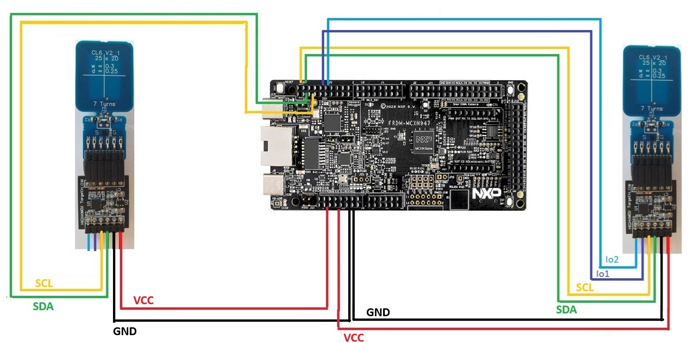
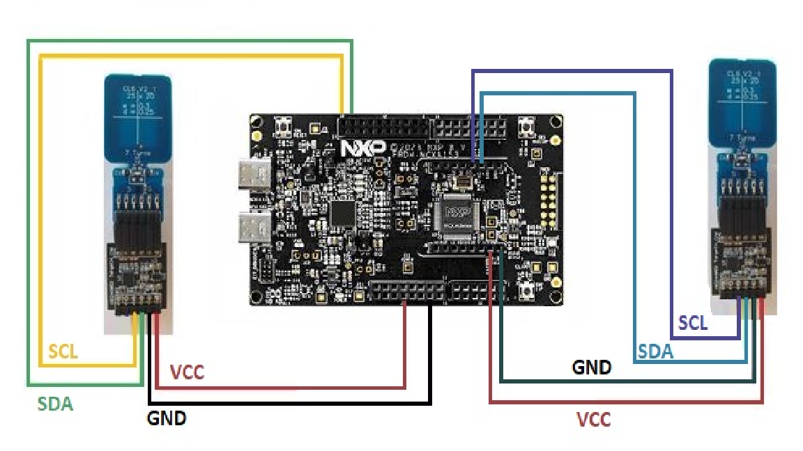

# NX Host co-processor example

The project demonstrates use case where host doesn\'t have the
capability to do crypto functions. 2 SAs are used in this case. One SA
is used with host as a coprocessor which works as Verifier/Prover.
Another SA is used independently as Prover/Verifier. Host will trigger
authentication by message MSGR_START_PROTOCOL. Sigma-I protocol
exchanging happens between verifier SA and prover SA. Host doesn\'t
process the Sigma-I protocol messages and only works a bridge between 2
SAs.

**Refer** [**NX Host Co-processor Example**](./host_coprocessor.c)


## Board Setup



**FRDM-MCXN947**



**FRDM-MCXA153**


## Prerequisites

- NX middleware stack. **Refer** [**MW stack**](../../../doc/stack/readme.md)

  - 2 SAs provision root CA public key and certificates
  - On SA Host co processor set configuration 0x10, I2C support, I2C
    address and ProtocolOptions of Controller Session Key.
  - run nxclitool for provision.
    - **A30 Sample Refer** [**nxclitool_scripts**](../../../binaries/configuration/a30_hostcert_depth2_x509_rev3_nistp/nxclitool_prov_device_root_cert.bat)
    - **NTAG Sample Refer** [**nxclitool_scripts**](../../../binaries/configuration/ntag_hostcert_depth2_x509_rev3_nistp/nxclitool_prov_device_root_cert.bat)
    - **Other Sample Refer** [**nxclitool_scripts**](../../../binaries/configuration/other_hostcert_depth2_x509_rev3_nistp/nxclitool_prov_device_root_cert.bat)
    - **NXP INIT CONFIG Sample Refer** [**nxclitool_scripts**](../nx_cli_tool/scripts/nxclitool_host_copro_perso_x509.bat)

## About the Example

This is project is demostrates host coprocessor mutual authentication between two 2 secure authenticators.
The secure messaging and response processing which is required for secure tunneling is offloaded to the coprocessor SA.
In order to achieve this,
- Host sends the command to coprocessor SA by Cmd.ProcessSM_Apply.
- Coprocessor SA returns encrypted data and/or MAC to host.
- Host constructs C-APDU command with encrypted data and/or MAC and sends to SA.
- After receiving R-APDU from SA, host sends encrypted response and/or MAC to coprocessor SA by Cmd.ProcessSM_Remove.
- Coprocessor SA returns decrypted plaintext and/or MAC verification result to the host.

It uses the following APIs and data types:

  - `nx_ProcessSM_Apply()`
  - `nx_Freemem()`
  - `nx_ProcessSM_Remove()`

## Building the Demo

- Build NX middleware stack. **Refer** [**Cmake Build**](../../../doc/mcu_cmake/readme.md)
- Project: `nx_host_coprocessor`

1)  `NXMW_Auth=None`
2)  `NXMW_Secure_Tunneling=None`
3)  `NXMW_Host=frdmmcxn947`
4)  `NXMW_SMCOM=T1oI2C_GP1_0`

## Running the Example

After you built a binary, flash the binary on to the board and reset
the board.
**Refer** [**Running the Example**](../../../doc/mcu_cmake/readme.md)
## Console output

If everything is successful, the output will be similar to:

```
nx_mw :INFO :Select Device 1 host co processor
nx_mw :INFO :Select Device 2 NX
nx_mw :INFO :Wait for Mutual authentication
nx_mw :INFO :Mutual authentication is success
nx_mw :INFO :FreeMem Device 2
nx_mw :INFO :ProcessSM_Apply Device 1
nx_mw :INFO :ProcessSMRemove Device 1
nx_mw :INFO :Available free memory: 12480 bytes
nx_mw :INFO :nx_host_coprocessor Example Success !!!...
```