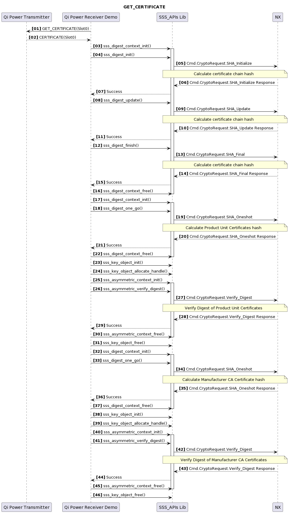

# Secure Authenticator (Qi) Authentication demo

This project is used to demonstrate the Qi authentication flow between a
Power Transmitter and a Power Receiver. The Power Transmitter implements
3 functions for the 3 authentication requests a Receiver can issue to
the Transmitter : `GetCertificateChainDigest`, `ReadCertificates`,
`Authenticate`.

<p align="left">
    
</p>

## Pre-requisites

- Correct keys and certificates for Qi Authentication are recorded in
  the header. Keys and certificates can be updated
  `demos/nx/sa_qi/inc/sa_qi_common.h`

- By default WPC Root certificate is used in the certificate chain. You
  would need to disable macro `USE_ROOT_WPCCA` in `sa_qi_rx_rootcert.c`
  to use test RootCA:

  Refer - `sa_qi_receiver/sa_qi_rx_rootcert.c`

## GetCertificateChainDigest (GET_DIGESTS)

This function reads the digest of certificate chains on the provided
slot ID and returns all the digests as requested by the Power Receiver.

<p align="left">
    
</p>

Refer - `qi_transmitter/qi_transmitter.c`

## ReadCertificates (GET_CERTIFICATE)

This function reads the certificate chain on the provided slot ID
starting from the provided offset and reading provided length bytes.

If the provided offset exceeds `0x600` then that indicates the power
transmitter to offset from the Product Unit Certificate. Otherwise the
offset starts from the beginning of the certificate chain.

Power Rx will receive certificate chain and verify Digest, PUC and
manufacture certificate with Nx

<p align="left">
    
</p>

Refer - `qi_transmitter/qi_transmitter.c`

## Authenticate (CHALLENGE)

This function performs the CHALLENGE operation and returns the signature
`R` and signature `S` values to the power receiver.

Power Rx will receive 16B nonce from Nx to initiate challenge request
The signature will be received at Rx side and Verify with Nx

<p align="left">
    
</p>

Refer - `qi_transmitter/qi_transmitter.c`

## Building the Demo

- Nx middleware stack. Refer [**Build**](../../../doc/windows/readme.md).

Build project:

Select host crypto as Mbedtls.

- Project: `sa_qi_receiver`

>**Note:** Qi Demo on MCXA153 currently supports only Symmetric Autentication.

## Running the Example

If you have built a binary, flash the binary on to the board and reset
the board.

If you have built an *exe* to be run from Windows using VCOM, run as:

```
sa_qi_receiver.exe <PORT NAME>
```

Where **\<PORT NAME\>** is the VCOM COM port.


## Console output

On successful execution you should be able to see logs as:

```
App   :INFO :NX_PKG_v02.00.00_20231107
App   :INFO :Running sa_qi_receiver.exe
App   :INFO :Using PortName='COM10' (CLI)
App   :INFO :Using certificate/key from:'C:\nxp\configuration\cert_depth3_PKCS7_rev1\' (Default path). You can specify certificates/keys file using ENV=NX_AUTH_CERT_DIR
App   :INFO :Read file from C:\nxp\configuration\cert_depth3_PKCS7_rev1\\cert_and_key\brainpool\host_leaf_keypair.der
Opening COM Port '\\.\COM10'
sss   :INFO :atr (Len=22)
      01 04 63 07    00 93 02 08    00 02 03 E8    00 01 00 64
      04 03 E8 00    FE 00
seTunnel:INFO :Read file from C:\nxp\configuration\cert_depth3_PKCS7_rev1\\cert_and_key\brainpool\device_root_certificate.der
seTunnel:INFO :Tx leaf cert request
seTunnel:INFO :Rx device certificate
seTunnel:INFO :Received hash match received leaf certificate.
seTunnel:INFO :Verify received ECC signature passed.
seTunnel:INFO :Verfiy X.509 certificate with root/cached CA certificate failed
seTunnel:INFO :Tx P1 cert request
seTunnel:INFO :Rx device certificate
seTunnel:INFO :Verfiy X.509 certificate with root/cached CA certificate failed
seTunnel:INFO :Tx P2 cert request
seTunnel:INFO :Rx device certificate
seTunnel:INFO :Verfiy X.509 certificate with certificate(C=NL, ST=Eindhoven, L=Eindhoven, O=NXP, CN=NXP Auth RootCAvE201) Passed
App   :INFO :Read file from C:\nxp\configuration\cert_depth3_PKCS7_rev1\cert_cache\device_ca_cert_0.hex
seTunnel:INFO :Read file from C:\nxp\configuration\cert_depth3_PKCS7_rev1\\cert_and_key\brainpool\host_leaf_certificate.der
seTunnel:INFO :Tx Leaf cert reply
seTunnel:INFO :Read file from C:\nxp\configuration\cert_depth3_PKCS7_rev1\\cert_and_key\brainpool\host_leaf_certificate.der
seTunnel:INFO :Tx P1 cert reply
seTunnel:INFO :Read file from C:\nxp\configuration\cert_depth3_PKCS7_rev1\\cert_and_key\brainpool\host_p1_certificate.der
seTunnel:INFO :Tx P2 cert reply
seTunnel:INFO :Read file from C:\nxp\configuration\cert_depth3_PKCS7_rev1\\cert_and_key\brainpool\host_p2_certificate.der
sss   :INFO :Session Open Succeed
App   :INFO :Send command GET_DIGESTS
App   :INFO :Retrieved digest (Len=32)
      42 98 7B 59    E9 4D 30 BF    CA 0E 8C 89    CE 1A 9B 71
      19 0A D2 EA    48 8F AD 54    6A 7E 90 86    F3 94 18 CC
App   :INFO :Send command GET_CERTIFICATE
App   :INFO :Certificate chain digest successfully verified
App   :INFO :Retrieved PUC (Len=290)
      30 82 01 1E    30 81 C6 A0    03 02 01 02    02 09 04 32
      02 59 8B 89    90 00 00 30    0A 06 08 2A    86 48 CE 3D
      04 03 02 30    12 31 10 30    0E 06 03 55    04 03 0C 07
      30 30 32 41    2D 54 30 30    22 18 0F 32    30 32 32 30
      34 32 38 30    30 30 30 30    30 5A 18 0F    32 30 34 32
      30 34 32 33    30 30 30 30    30 30 5A 30    18 31 16 30
      14 06 03 55    04 03 0C 0D    30 30 36 33    38 36 2D 4D
      6F 64 65 6C    35 30 39 30    13 06 07 2A    86 48 CE 3D
      02 01 06 08    2A 86 48 CE    3D 03 01 07    03 22 00 02
      8B 9C DC 5E    24 F1 E1 39    B2 04 09 4A    47 B6 B6 FA
      30 0D 18 16    BC B6 53 6D    D8 7F 8F FC    C5 43 46 C0
      A3 1B 30 19    30 17 06 05    67 81 14 01    02 01 01 FF
      04 0B 04 09    02 21 18 95    62 64 00 00    02 30 0A 06
      08 2A 86 48    CE 3D 04 03    02 03 47 00    30 44 02 20
      11 DB FA D4    80 B5 BA 2A    82 09 9C FB    C9 45 CE FD
      C8 D2 5E CB    C5 F1 40 D4    7D EE F5 70    08 5B A2 3E
      02 20 21 07    A9 80 92 2E    19 ED 74 1E    EF AE 66 10
      DE 32 8C 38    68 B3 65 42    EB 2B 44 D2    4C 87 E3 CC
      0C 1F
App   :INFO :PUC successfully verified
App   :INFO :Manufacturer certificate successfully verified
App   :INFO :Certificate chain successfully verified
App   :INFO :Retrieved PUC public key (Len=65)
      04 8B 9C DC    5E 24 F1 E1    39 B2 04 09    4A 47 B6 B6
      FA 30 0D 18    16 BC B6 53    6D D8 7F 8F    FC C5 43 46
      C0 89 85 ED    B7 DD 74 17    A3 C1 2F CA    F5 3A B7 41
      54 D2 47 81    08 30 7C 50    AB 33 77 C2    89 94 48 70
      C0
App   :INFO :Send command CHALLENGE
App   :INFO :Challenge Signature (Len=64)
      87 86 44 39    15 F5 53 44    7B 42 77 50    06 D4 A1 3C
      E4 CE 9E 0C    D9 75 85 17    89 64 15 14    AC 96 40 17
      02 3E 10 36    48 38 C3 2A    9C F0 1C 90    5B 69 0B E8
      F1 83 A2 21    63 34 7D 79    D3 3E B1 1F    D1 01 FA D0
App   :INFO :TBSAuth (Len=54)
      41 42 98 7B    59 E9 4D 30    BF CA 0E 8C    89 CE 1A 9B
      71 19 0A D2    EA 48 8F AD    54 6A 7E 90    86 F3 94 18
      CC 1B 00 EF    6E 3F D2 33    3A B6 01 54    38 EE 1E 56
      E5 9A C6 13    11 CC
App   :INFO :Challenge successfully verified
App   :INFO :sa_qi_receiver Example Success !!!...
App   :INFO :ex_sss Finished
```