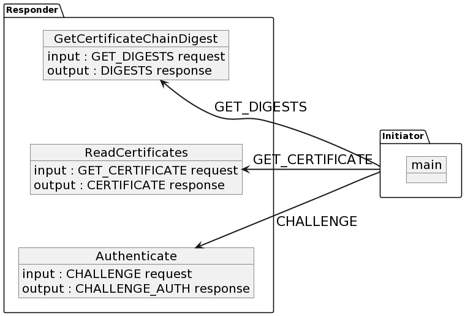
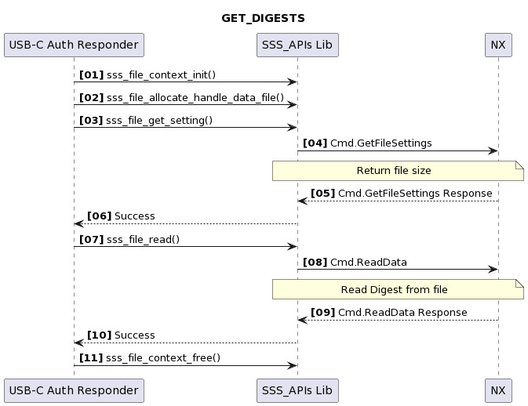
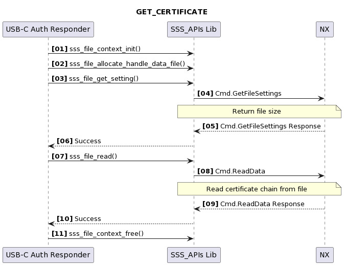
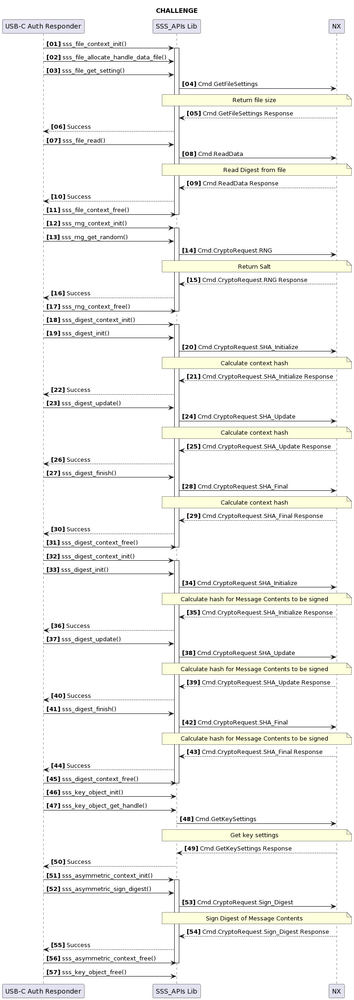

# Universal Serial Bus Type-C (USB-C) Authentication demo

This project is used to demonstrate the USB-C authentication flow
between an Auth Responder and an Auth Initiator. The Auth Responder
implements 3 functions for the 3 authentication requests an Auth
Initiator can issue to the an Auth Responder :
`GetCertificateChainDigest`, `ReadCertificates`, `Authenticate`.

<p align="left">
    
</p>

## Pre-requisites

-   The Secure Authenticator should be trust provisioned with correct
    keys and certificates for USB-C Authentication. Keys and
    certificates can be provisioned for test purpose by updating keys in
    `demos/nx/usb_c/usb_c_provisioning/usb_c_credentials.c` and running example
    `ex-nx-usb_c-provisioning`.
-   By default USB-IF Root certificate is used in the certificate chain.
    If example `ex-nx-usb_c-provisioning`
    is run, you would need to disable macro `USE_ROOT_USBIF` in
    `usb_c_rootcert.c` to use test
    RootCA: usb_c_auth/usb_c_rootcert.c

## GetCertificateChainDigest (GET_DIGESTS)

This function reads the digests of certificate chains stored inside the
Secure Authenticator and returns all the digests as requested by the
USB-C initiator.

<p align="left">
    
</p>

Refer - `usb_c_responder_auth/usb_c_responder.c`

## ReadCertificates (GET_CERTIFICATE)

This function reads the certificate chain on the provided slot ID
starting from the provided offset which starts from the beginning of the
certificate chain and reading provided length bytes.

<p align="left">
    
</p>

Refer - `usb_c_responder_auth/usb_c_responder.c`

## Authenticate (CHALLENGE)

This function performs the CHALLENGE operation and returns the signature
`R` and signature `S` values to the power receiver.

<p align="left">
    
</p>

usb_c_responder_auth/usb_c_responder.c


## Building the Demo

- Build NX middleware stack. Refer [**Linux build**](../../../doc/linux/readme.md).

  - Project - `usb_c_auth`

## Running the Example

```
./usb_c_auth
```

## Console output

On successful execution you should be able to see logs as:

```
sss   :INFO :Session Open Succeed
App   :INFO :Send command GET_DIGESTS
App   :INFO :Retrieved digest (Len=32)
      66 09 26 B6    CB 61 86 5C    60 78 1A 98    92 AB F4 B7
      C2 4A B6 27    7C 2A 69 84    8A C6 90 B4    1C 18 63 E1
App   :INFO :Send command GET_CERTIFICATE
App   :INFO :Certificate chain digest successfully verified
App   :INFO :Retrieved Leaf Certificate (Len=479)
      30 82 01 DB    30 82 01 81    A0 03 02 01    02 02 09 00
      81 9F 59 97    6B 38 47 91    30 0A 06 08    2A 86 48 CE
      3D 04 03 02    30 2B 31 15    30 13 06 03    55 04 0A 0C
      0C 4F 72 67    4E 61 6D 65    20 49 6E 63    2E 31 12 30
      10 06 03 55    04 03 0C 09    55 53 42 3A    31 61 30 61
      3A 30 22 18    0F 31 39 37    30 30 31 30    31 30 30 30
      30 30 30 5A    18 0F 39 39    39 39 31 32    33 31 32 33
      35 39 35 39    5A 30 42 31    15 30 13 06    03 55 04 0A
      0C 0C 4F 72    67 4E 61 6D    65 20 49 6E    63 2E 31 16
      30 14 06 03    55 04 03 0C    0D 55 53 42    3A 31 61 30
      61 3A 30 31    30 31 31 11    30 0F 06 03    55 04 05 13
      08 35 35 36    36 37 37 38    38 30 59 30    13 06 07 2A
      86 48 CE 3D    02 01 06 08    2A 86 48 CE    3D 03 01 07
      03 42 00 04    A9 B0 F8 66    B0 2D 91 2B    87 64 22 57
      D2 AE 0B 07    E1 FA 83 A6    8E B4 4F 3F    16 79 43 A3
      E5 D8 00 72    DC 0A D5 B3    00 A4 FB 8B    C0 05 3B 4D
      7C 9D 8D 48    BB AC 46 8C    E5 28 B7 5B    1C 5A FA 2E
      4D DA 38 45    A3 73 30 71    30 0C 06 03    55 1D 13 01
      01 FF 04 02    30 00 30 0B    06 03 55 1D    0F 04 04 03
      02 07 80 30    13 06 03 55    1D 25 01 01    FF 04 09 30
      07 06 05 67    81 11 01 01    30 3F 06 05    67 81 11 01
      02 04 36 00    02 40 00 01    04 00 00 12    34 02 16 02
      01 01 00 03    07 01 00 2A    0A 2A 0A 2A    0A 00 00 00
      01 2A 01 91    2C 05 06 00    00 00 55 1A    0A FD 04 54
      45 53 54 FE    04 1A 0A 12    34 30 0A 06    08 2A 86 48
      CE 3D 04 03    02 03 48 00    30 45 02 20    73 DB 58 34
      78 91 0C B9    C3 F5 6C 00    AB 6E 9C E0    E0 13 B1 A3
      41 D4 12 5F    3B E0 E9 31    A3 C3 6E D5    02 21 00 C6
      CF 1D BD 9D    0F B1 2C 5B    EF 17 4E 30    44 52 C3 27
      FA A2 FA 40    29 F5 49 65    31 21 05 C2    BB 2B 35
App   :INFO :Certificate chain successfully verified
App   :INFO :Retrieved Leaf certificate public key (Len=65)
      04 A9 B0 F8    66 B0 2D 91    2B 87 64 22    57 D2 AE 0B
      07 E1 FA 83    A6 8E B4 4F    3F 16 79 43    A3 E5 D8 00
      72 DC 0A D5    B3 00 A4 FB    8B C0 05 3B    4D 7C 9D 8D
      48 BB AC 46    8C E5 28 B7    5B 1C 5A FA    2E 4D DA 38
      45
App   :INFO :Send command CHALLENGE
App   :INFO :Challenge Signature (Len=64)
      D2 BF 7D C1    60 87 1B E9    26 39 C1 12    4B 2B BF 3A
      74 12 53 A7    34 B2 9E 9A    6C 4D DB CD    3F 5F 93 92
      98 40 7A 62    A4 FA F1 98    AB BF E5 9B    C0 E1 38 51
      76 B9 15 0D    79 C5 59 28    C9 1B 94 1C    53 BE 9E 5F
App   :INFO :Message Content (Len=140)
      01 83 00 00    30 61 B9 F0    7F 61 97 9B    90 5A DE 8F
      6C 80 23 74    42 AB C3 BD    5B 7B C9 84    CC 69 2E AE
      0F 62 D3 BA    01 03 00 01    01 01 01 00    66 09 26 B6
      CB 61 86 5C    60 78 1A 98    92 AB F4 B7    C2 4A B6 27
      7C 2A 69 84    8A C6 90 B4    1C 18 63 E1    EA CB 25 1A
      C4 B2 90 E2    3E 29 6E AD    5C 68 0E 79    86 50 44 C4
      79 93 55 4D    9E C9 4A 6C    56 9A F6 70    66 68 7A AD
      F8 62 BD 77    6C 8F C1 8B    8E 9F 8E 20    08 97 14 85
      6E E2 33 B3    90 2A 59 1D    0D 5F 29 25
App   :INFO :Challenge successfully verified
App   :INFO :usb_c_auth Example Success !!!...
App   :INFO :ex_sss Finished
```

## Porting

The example allows porting of host verification and host RNG functions
in case mbedTLS is not available. If you want to add your own
implementation of these operations, update the following APIs in
`usb_c_initiator_auth/usb_c_initiator_helper_port.c`:
