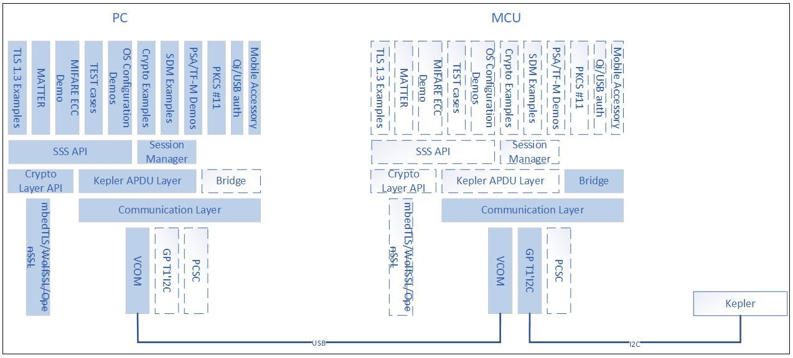
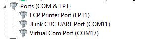

# VCOM

Virtual COM Port interface can be used to connect to the SA from
development PC/Laptop. This gives advantage of faster turn around time
for development and feature experimentation.

>**Note:** If the VCOM drivers are not installed on your PC, you would have to install it.

Embedded platforms supported:
 `LPCXpresso55s69`
 `frdmmcxn947`
 `frdmmcxa153`

The overall architecture looks like this:

    

## Building the Demo

- Nx middleware stack. Refer [**Build**](../../../doc/windows/readme.md).

Build project:

- Project: `vcom`

## Steps to use VCOM for running the examples - PC & supported embedded platforms

- Connect supported embedded platform with, SA attached to it on, the USB Interface (Not
  the MCU_LINK Debug).
- supported embedded platform should have the VCOM firmware flashed onto it which shall do
  the VCOM-I2C translation. (For more details, refer `vcom`).
- Open device manager, Under Ports (COM & LPT), look for the connected
  device.

    

- specify this COM port for connecting from PC. For e.g. `COM17` as per
  the above image.

>**Note:** It appears as "Virtual Com Port" or "USB Serial Device" based on the driver installed in the system.