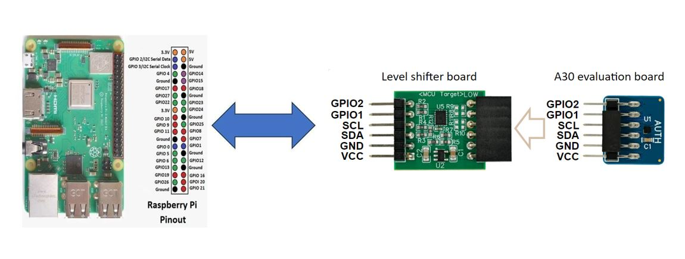
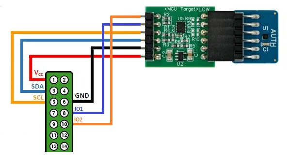

# Getting started on Linux (Raspberry Pi 4)

Run the following commands to build and run examples on Linux / Raspberry Pi 4

## Prerequisites

- Linux should be running on the Raspberry Pi 4 development board (tested with Raspbian Buster (4.19.75-v7l+))

- Connect NX Secure Authenticator to I2C Linux of Linux machine (Example - consider Raspberry-Pi) as shown below,

	<p align=left>
	
	</p>

	<p align=left>
	
	</p>

	<p align=left>
	
	</p>

- Enable I2C if not yet enabled on your board. (If ``ls /sys/bus/i2c/devices`` does not list ``i2c-1``)

    - Run ``sudo raspi-config``

    - Use the down arrow to select ``Interface Options``.

    - Follow instructions and Enable I2C


- Install following packages required for the build

```console
sudo apt-get install cmake cmake-curses-gui cmake-gui libssl-dev libsystemd-dev
```


## Build instructions

Execute the below commands to build and install the nx middleware

```console
git clone ssh://git@github.com:NXP/nxmw.git nx-mw-top
cd nx-mw-top/scripts
python create_cmake_projects.py
cd ../../nx-mw-top_build/raspbian_native_nx_t1oi2c

# Change the cmake options if required by running ccmake .

cmake --build .
sudo make install
sudo ldconfig /usr/local/lib
````

If required cmake options can be changed and libraries can be rebuilt and installed as

```console
cd nx-mw-top_build/raspbian_native_nx_t1oi2c
ccmake .
```
Refer [**cmake options**](../config/readme.md) for more details

Single example (target) can be built using the following command:
```
cmake --build . --target <TARGET_NAME>
```
or
```
make <TARGET_NAME>
```


Run the required example as -

```console
./<example>.bin
````


---
**NOTE**

A precondition for enabling Sigma-I authentication (setting the CMAKE option NXMW_Auth to SIGMA_I_Verifier or SIGMA_I_Prover) is to provision secure authenticator and the host with the required Sigma-I credentials using one of the following options:

1.	Using of the NXP pre-provisioned A30 Sigma-I credentials.
	- During manufacturing, A30 is trust-provisioned with a private EC key and the related A30 Leaf Certificate. (For further details see A30 application notes)

2. On-chip EC key generation and import of the related A30 certificates into the X.509 Certificate Repository.

3. Import of private EC key and import of the related A30 certificates into the X.509 Certificate Repository. ( Refer to nx_personalization example - [**nx_personalization**](../../demos/nx/nx_Personalization/readme.md).
	- Alternative the nx_cli_tool and the script file nxclitool_perso_x509.sh can be used. )
---
