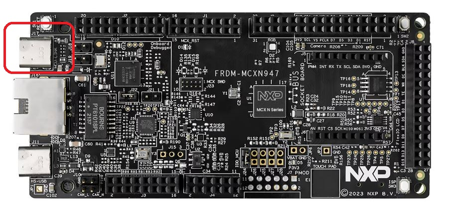
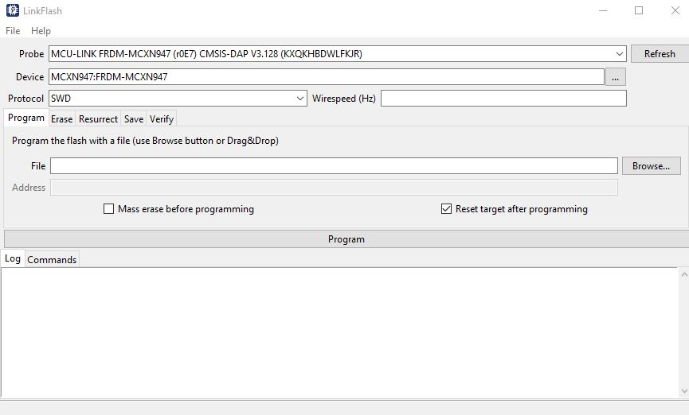
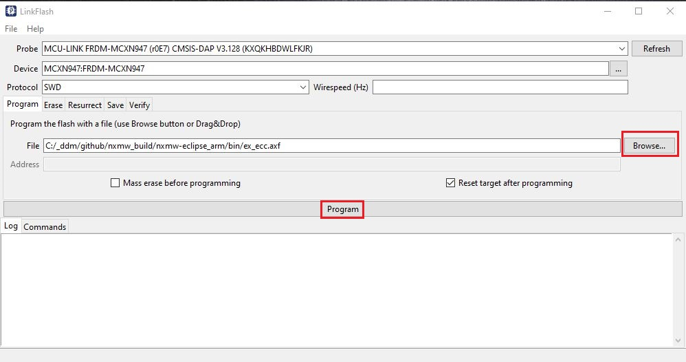
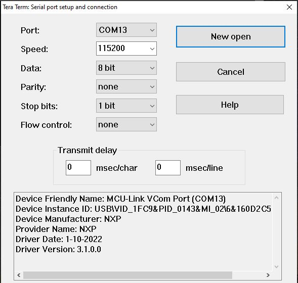
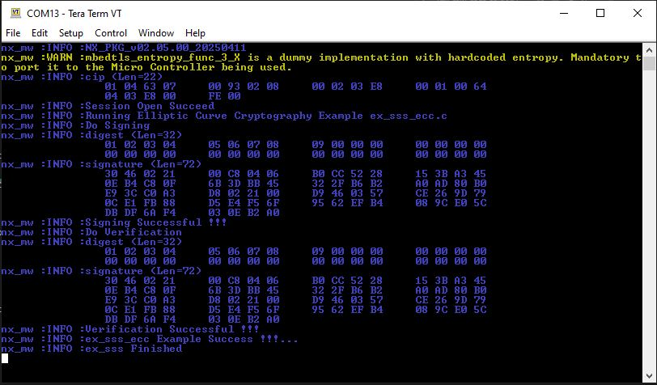

# Getting started for MCUs Using Cmake Build

The NX middleware examples / demos can be cross compiled for MCXN947 / MCXA153 / LPC55S69 on Windows.

```
NOTE: MCXN947 is used as an Host MCU example in the following documentation.
```

## Prerequisite

- MCUXpresso IDE 24.12 (<https://www.nxp.com/support/:MCUXpresso-IDE>)
  installed. (Update the installed path in file nxmw/scripts/env_setup.bat)
- SDKs installed for supported MCUs (V24.12.00 for MCXN947/LPC55S69/MCXA153) (To download SDK, refer [**MCUXpresso SDK Dashboard**](https://mcuxpresso.nxp.com/en/select))
- Python installed (version 3.10 or above). Please follow the guideline at [Python Download](https://wiki.python.org/moin/BeginnersGuide/Download).
- West installed (version 1.2.0 or above). Please follow [west setup](https://docs.zephyrproject.org/latest/develop/west/install.html) to install west
- CMake installed (version 3.30.0 or above). Preferably at C:/opt/cmake/bin/cmake.exe
- Connect MCXN947/MCXA153/LPC55S69 using the debug link port to Windows

<p align=left>

</p>

- Secure authenticator connected to MCXN947/MCXA153/LPC55S69 (Refer: [**MCU Pin Diagram**](../../boards/README.md))

- The overall set up will look as shown below.

<p align=left>

</p>

## Getting the NX Middleware Source

- Follow the following steps to create a new workspace which downloads the NX middleware and the required files.

```console
west init -m https://github.com/NXP/nxmw.git --mf mcu_sdk/west.yml workspace
OR
west init -m https://github.com/NXP/nxmw.git --mr <branch name> --mf mcu_sdk/west.yml workspace

cd workspace
west update
```

>**Note:** The complete setup takes 10-15 minutes to finish. If network error occured, you will see a message update failed for project. Try `west update` again.

- Once downloaded you should have the NX middleware and all the required SDK files.

- If you have cloned the NX Middleware using git, and west setup is not done, you can follow the following steps to download the MCU SDK,

```console
cd nxmw
west init -l --mf mcu_sdk/west.yml
cd ..
west update
```

## Create Build files

Use `nxmw/scripts/create_cmake_projects.py` to generate the build files -

```console
cd nxmw/scripts
env_setup.bat
python create_cmake_projects.py
```

>**Note:** The env_setup.bat files defines the development tools environment. Depending on your tools (MCUXpresso, Visual Studio, Java, Python and CMake) file locations you may need to update the tools paths within the env_setup.bat file.

Build files are generated at `nxmw_build/`

- Use the build environment `nxmw_build/nxmw-eclipse_arm` to cross compile for MCXN947/MCXA153/LPC55S69 :

```console
cd nxmw_build/nxmw-eclipse_arm
make
```

- By default the cmake options are set as below.

```
   CMAKE_BUILD_TYPE:STRING=Debug
   NXMW_ALL_Auth_Code:STRING=Enabled
   NXMW_Auth:STRING=SYMM_Auth
   NXMW_Auth_Asymm_CA_Root_Key_Id:STRING=0
   NXMW_Auth_Asymm_Cert_Repo_Id:STRING=0
   NXMW_Auth_Asymm_Cert_SK_Id:STRING=0
   NXMW_Auth_Asymm_Host_Curve:STRING=NIST_P
   NXMW_Auth_Asymm_Host_PK_Cache:STRING=Enabled
   NXMW_Auth_Symm_App_Key_Id:STRING=0
   NXMW_Auth_Symm_Diversify:STRING=Disabled
   NXMW_CMSIS_Driver:STRING=Disabled
   NXMW_Host:STRING=lpcxpresso55s
   NXMW_HostCrypto:STRING=MBEDTLS
   NXMW_Log:STRING=Default
   NXMW_MBedTLS:STRING=2_X
   NXMW_NX_Type:STRING=NX_R_DA
   NXMW_OpenSSL:STRING=1_1_1
   NXMW_RTOS:STRING=Default
   NXMW_SA_Type=A30
   NXMW_SMCOM:STRING=T1oI2C_GP1_0
   NXMW_Secure_Tunneling:STRING=NTAG_AES128_EV2
   NXMW_mbedTLS_ALT:STRING=None
```

- Change the cmake options if required. For more details on cmake
  Cmake Configurations - [**Cmake Configurations**](../config/readme.md)


>**Note:** The Sigma Verifier/Prover demo requires to run the Personalization example once first. Refer [**Personalization**](../../demos/nx/nx_Personalization/readme.md).


## Setting up MCUXPresso IDE

1.  Download MCUXpresso 24.12 from:
    <https://www.nxp.com/support/developer-resources/software-development-tools/mcuxpresso-software-and-tools/mcuxpresso-integrated-development-environment-ide:MCUXpresso-IDE>
2.  For additional help please refer to:
    <https://www.nxp.com/webapp/Download?colCode=MCUXPRESSO-UG>

## Running the Example

- Link Flash will get installed when installing the MCUXpresso IDE. If not installed, install it from:

    <https://www.nxp.com/design/design-center/software/development-software/mcuxpresso-software-and-tools-/linkserver-for-microcontrollers:LINKERSERVER>

- Open Link Flash to flash the binary.

- The probe and device will get detected automatically based on the MCU connected with PC.

<p align=left>

</p>

- Click on browse and select the .axf or .bin file to be flashed and click on program to flash the file.

>**Note:** If .bin file is selected, specify the address (0x00 for MCXN947/MCXA153/LPC55S69).


<p align=left>

</p>

- Once flashed successfully, MCU will reset automatically and program execution will start. Logs will show-up on the terminal (logging in next section). To re-run the same program, press reset button on the MCU.

## Logging on The Console

- Open Tera Term and connect serial port.

<p align=left>

</p>

- Once the program execution begins, logs are printed on the terminal (Tera
Term) indicating the status of execution.

<p align=left>

</p>