# Getting Started on MCUs Using Standalone MCUXpresso Projects

## Prerequisites

1) Secure Authentication MW source is cloned from github. (Refer: [**Getting the NX Middleware Source**](../../doc/windows/readme.md)).
2) MCUXpresso IDE v24.12.148 or above is installed (To download the IDE and user guide, refer: [**MCUXpresso IDE**](https://www.nxp.com/design/design-center/software/development-software/mcuxpresso-software-and-tools-/mcuxpresso-integrated-development-environment-ide:MCUXpresso-IDE)).
3) SDK installed for supported MCUs (V24.12.00 for MCXN947/LPC55S69/MCXA153) (To download SDK, refer [**MCUXpresso SDK Dashboard**](https://mcuxpresso.nxp.com/en/select))
4) Secure Authenticator connected to Host MCU (Refer: [**MCU Pin Diagram**](../../boards/README.md)).
5) The overall set up will look as shown below.

## SDK Installation on MCUXpresso

- Open the MCUXpresso IDE and close the welcome page that shows on startup. The IDE should look like below image.

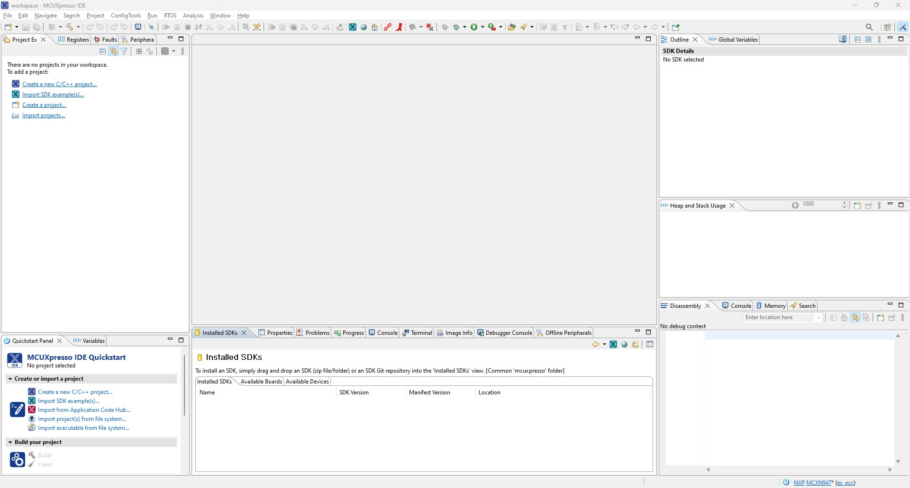

- Before importing a project, Software Development Kit (SDK) needs to be installed in the IDE corresponding to the board being used. To do this, go to [**SDK Builder**](https://mcuxpresso.nxp.com/en) on NXP website, select the required development board and build the SDK. Once built, download the SDK zip file.

- To install the SDK, drag the zipped SDK folder and drop in the installed SDK section highlighted in below image. If not done by default, select the SDK corresponding to the development board by clicking on the checkbox in front of the SDK.

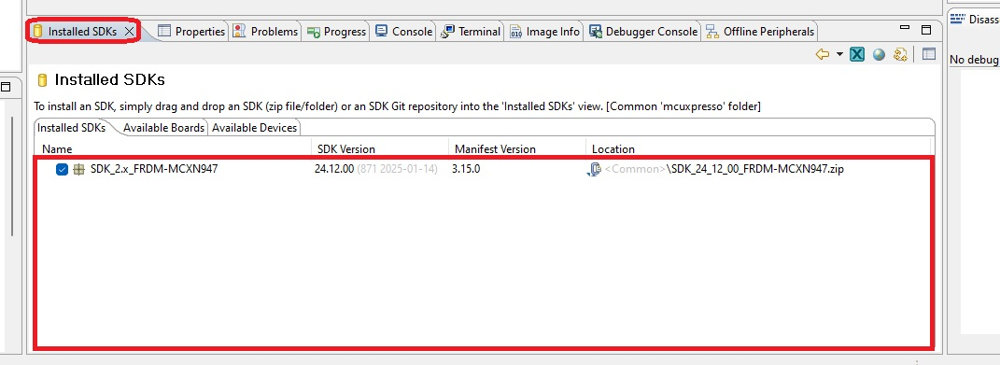

## Importing The Project

- To import a project, go to **File** -> **Open Project from File System...**. In the dialog box that opens, click on **Directory...** and navigate to the target project in the folder corresponding to the required development board, select the required project and click on **Select Folder**.

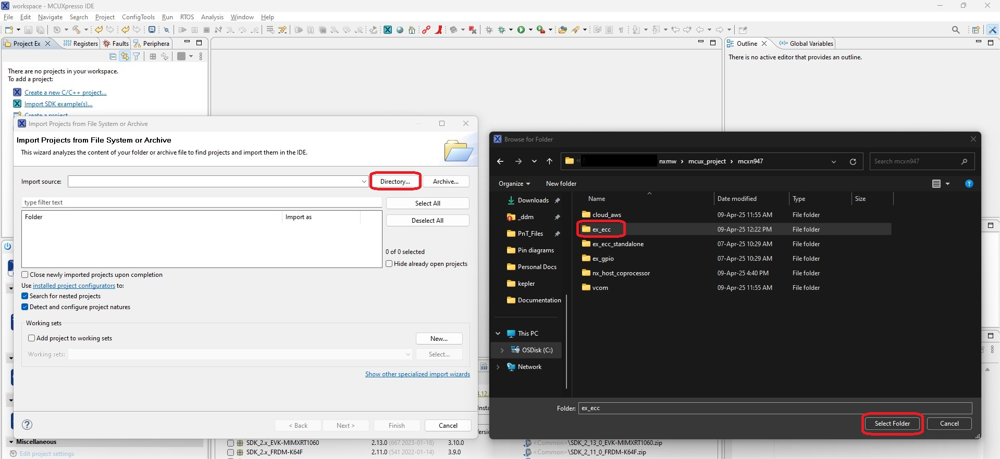

- Select the project name in the dialog box and click on **Finish** to import the project.

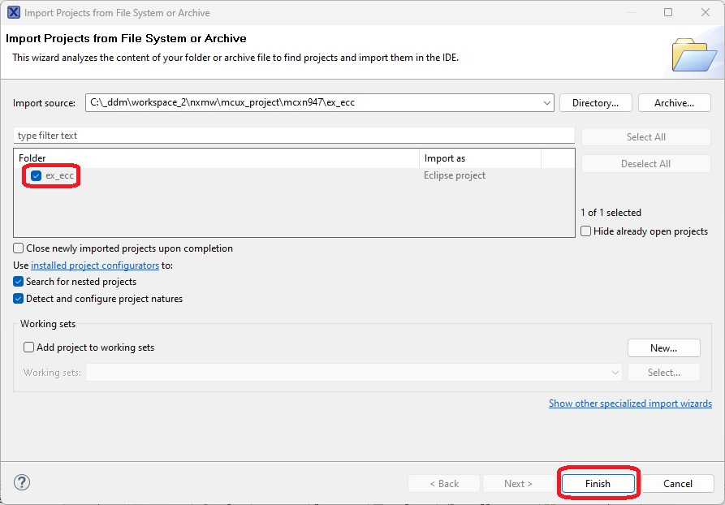

>**Note:** It is not possible to import two projects with the same name in IDE. If another project of same name is to be imported, project suffix needs to be added.

- The project can be viewed in the side panel under **Project Explorer** section. All the files linked to this project can be viewed here.

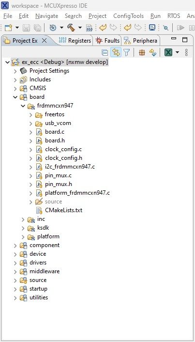

## Build and Flash The Project

- To build the project, select the project in **Project Explorer** and click on the **Build** icon. The build logs will show up in the console below.

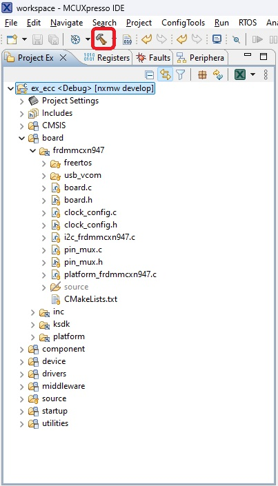

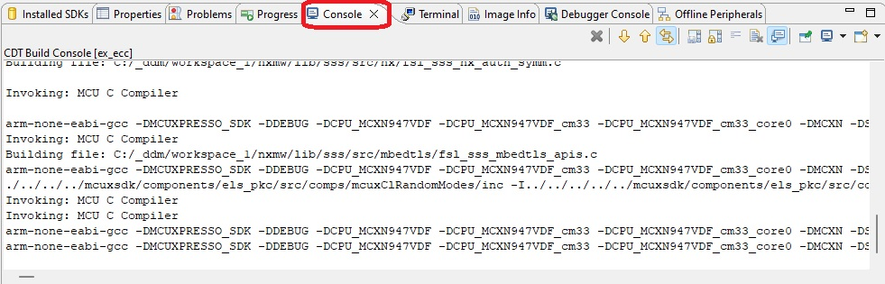

- Once the project is built successfully, the generated binary can be flashed using the GUI Flash Tool. Ensure that the development board is connected to the system and SA is properly connected to the board (refer to the end of this section for board setup). Select the project and click on the GUI Flash Tool icon as shown below.

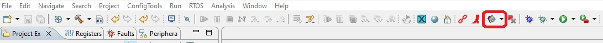

- In the dialog box, select the corresponding probe (only one probe will show if one board is connected) and click on OK.

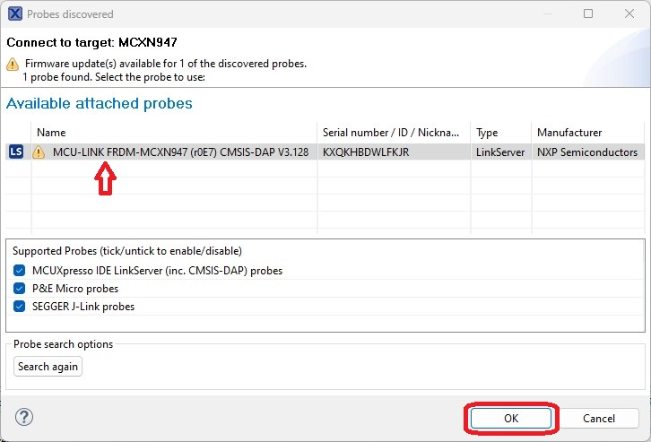

- In the next dialog box, in file to program, by default the latest generated binary (in `.axf` format) will be selected. Click **Run...** to flash the binary.

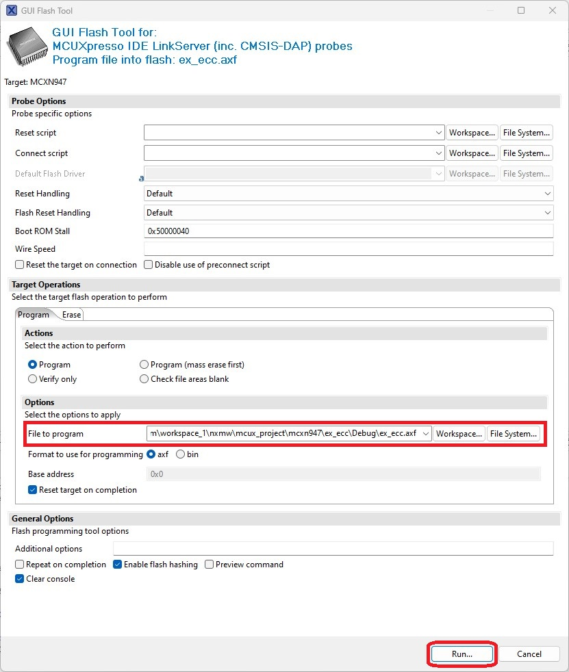

## Debugging The Project

- To start debugging the project, select the project in Project Explorer and press the debug icon as shown below.

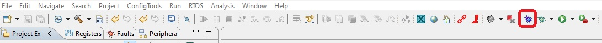

## Running The Project

- Open Tera Term and connect serial port.

- Once the program execution begins, logs are printed on the terminal(Tera
Term) indicating the status of execution.

