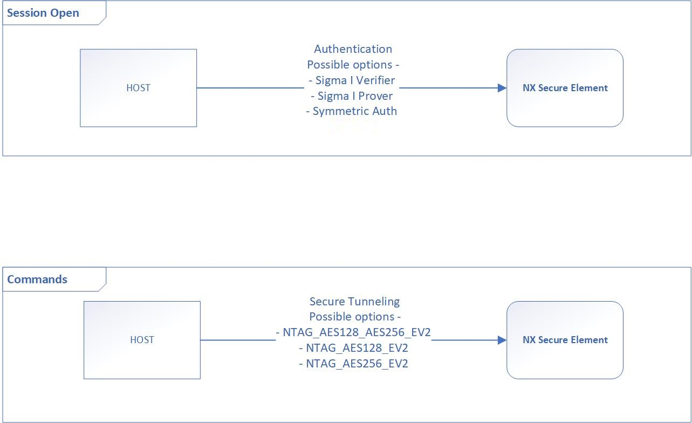
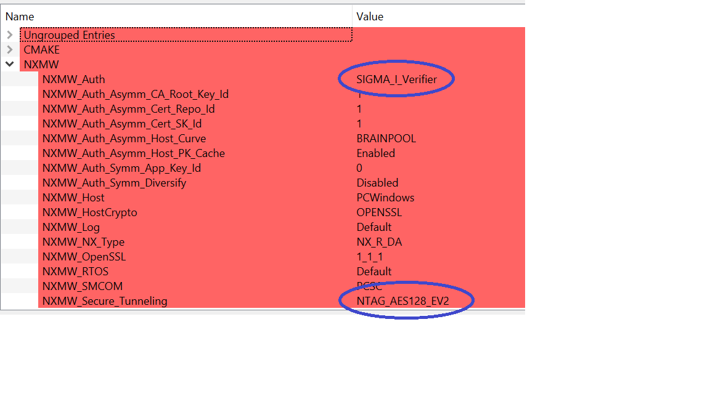
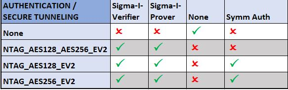
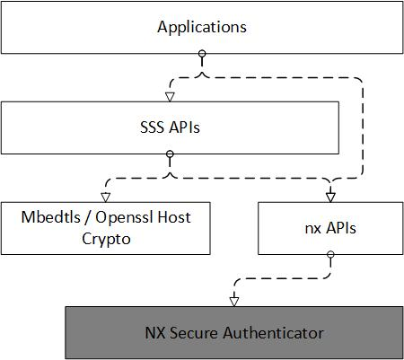

# NX Middleware Stack

NX Middleware provides the necessary interfaces, examples, demos for NX Secure Authenticator (SA) IC.
The **nx-mw-top/lib** folder contains necessary files required to connect / use the NX secure authenticator.
The middleware also has crypto examples ([**demos**](../../demos)), plugins (OpenSSL engine, provider) ([**plugin**](../../plugin))

Below section describe the secure session and the APIs exposed by the NX middleware stack to access NX secure authenticator.
And finally the section describing on writing your own application.


<br />
<br />

## NX Secure Authenticator session

Before starting any operation, the host is required to establish an authenticated session to NX Secure Authenticator.

Supported authenticated sessions are

    - None
    - Sigma-I-Verifier
    - Sigma-I-Prover
    - Symmetric Authentication

After the successful authentication, commands are required to be sent using any of the following Secure Messaging modes

    - None
    - NTAG_AES128_EV2.
    - NTAG_AES256_EV2.
    - NTAG_AES128_AES256_EV2 (Only for Sigma-I)


<p align=left>

</p>


All of the above session authentication and command encryption modes can be selected using the cmake options.
For more details on cmake options - refer [**cmake options**](../config/readme.md),
<p align=left>

</p>


Following table shows valid combinations of session auth and secure tunneling modes.
<p align=left>

</p>


To setup Sigma-I session, host will require and verify Secure Authenticator's certificate chain.
Optionally, host can cache the public key in the leaf certificate and also the leaf certificate's value. This is utilized to accelerate protocol execution time by removing the need to validate public key certificates that have been previously verified.

The host can also cache Secure Authenticator's parent certificates. This can accelerate protocol execution time by removing the
need to require parent certificate that have been previously verified from Secure Authenticator.

The cache feature can be enabled/disabled by cmake option NXMW_Auth_Asymm_Host_PK_Cache. (Maximum supported = 5).

Also, to setup Sigma-I session, host will provide its certificates chains to Secure Authenticator for verification. The certificates chains are stored based on the host OS type.

On Windows (Support to be added in subsequent releases) / Linux systems, the middleware will looks for certificate chain in following priority:

    - Folder indicated by ENV variable "NX_AUTH_CERT_DIR"
    - Folder "C:\nxp\configuration\cert_depth3_x509_rev1\"(Windows) or "/tmp/configuration/cert_depth3_x509_rev1/" (Linux)
    - Hard coded certificates defined in :file:`nx-mw-top/lib/sss/inc/fsl_sss_nx_auth_keys.h`

Other micro-controllers: (Support to be added in subsequent releases)

    - Hard coded certificates defined in :file:`nx-mw-top/lib/sss/inc/fsl_sss_nx_auth_keys.h`


```
NOTE:
    The hard coded certificates and related private keys are stored in plain text for demonstration purposes only. During actual product deployment, customer has to adopt secure means as per their security needs (note that the potential issue is more with the private keys than certificates).
```

```
NOTE:
    T=1oI2C: When using the T=1oI2C smcom interface, at the beginning of session open, we do a dummy read (function - `phNxpEse_clearReadBuffer`) from the secure authenticator if any previous session data is pending and discard the data.
```


<br />
<br />

## NX Middleware APIs

### Session Open APIs

Before starting any operation, the host is required to establish an authenticated session to NX Secure Authenticator.

Use the following APIs to open the session to NX secure authenticator.

```c
/*
Initialize authentication parameters for sigma auth.
*/
sss_status_t nx_init_conn_context_sigma_auth(nx_connect_ctx_t *nx_conn_ctx,
    nx_auth_type_t auth_type,
    nx_secure_symm_type_t secure_tunnel_type,
    sss_cipher_type_t host_cert_curve_type,
    sss_cipher_type_t host_ephem_curve_type,
    auth_cache_type_t cache_type,
    auth_compress_type_t compress_type,
    uint8_t se_cert_repo_id,
    uint16_t cert_ac_map);

OR

/*
    Initialize authentication parameters for symmetric auth.
*/
sss_status_t nx_init_conn_context_symm_auth(nx_connect_ctx_t *nx_conn_ctx,
    nx_auth_type_t auth_type,
    nx_secure_symm_type_t secure_tunnel_type,
    uint8_t key_no,
    bool pcdcap2_flag);


/*
    Initialize/ Prepare host crypto for authentication set up.
*/
sss_status_t nx_prepare_host_for_auth(
    sss_session_t *host_session, sss_key_store_t *host_ks, nx_connect_ctx_t *nx_conn_ctx);


/* Open session to NX Secure authenticator */

sss_status_t sss_session_open(sss_session_t *session,
sss_type_t subsystem,
uint32_t application_id,
sss_connection_type_t connection_type,
void *connectionData);


/* Create key store (Used in SSS APIs) */

sss_status_t sss_key_store_context_init(sss_key_store_t *keyStore, sss_session_t *session);

sss_status_t sss_key_store_allocate(sss_key_store_t *keyStore, uint32_t keyStoreId);
```

### Crypto APIs

NX Middleware provides 2 set of crypto APIs to access the NX secure authenticator.

    - SSS APIs
    - nx APIs

<p align=left>

</p>

#### SSS APIs

Not all NX Secure Authenticator features are covered using SSS APIs.
Only the crypto functionality which can be switched between host and Nx secure authenticator are supported using SSS APIs.
For all other use cases, use Nx APIs.

``SSS`` is an acronym for **S**\ ecure **S**\ ub **S**\ ystem

The SSS APIs are functional APIs to abstract the access to various types of Cryptographic Sub Systems.  Such secure
subsystems could be (but not limited to):

    - Secure Authenticators
    - Software crypto
    - Cryptographic HWs

When using SSS APIs, all the keys are referenced using the key Object. ``sss_object_t``.
Use the following APIs to create / initialize the key object.

```c
sss_status_t sss_key_object_init(sss_object_t *keyObject, sss_key_store_t *keyStore);

sss_status_t sss_key_object_allocate_handle(sss_object_t *keyObject,
    uint32_t keyId,
    sss_key_part_t keyPart,
    sss_cipher_type_t cipherType,
    size_t keyByteLenMax,
    uint32_t options);
```

The key store parameter in the ``sss_key_object_init`` api will decide where the key has to be stored (Host or Nx Secure Authenticator).

Now, apart from the dedicated key-stores for asymmetric and symmetric keys, Nx Secure Authenticator also has two types of buffers- static and transient which can be used to store any data including keys. The cipherType parameter in ``sss_key_object_allocate_handle`` has been designed with the flexibility to incorporate this functionality too- the enum value kSSS_CipherType_BufferSlots for cipherType corresponds to the these internal buffers. In that case, the keyId would be interpreted as the unique Id for the internal buffer in the Nx Secure Authenticator. Other values for cipherType shall be interpreted as the natural key stores in Nx Secure Authenticator or the Host.

Demos like `ex-sss-ecdh`, `ex-sss-md-using-slots` can be referred to understand how the internal buffers are used.

Refer `fsl_sss_api.h` for complete set of SSS APIs supported.


#### NX APIs

These are the low level apis which create / encrypt / decrypt / transrecive the APDUs of the NX secure authenticator.

Refer `nx_apdu.h` for complete set of Nx APIs supported.


<br />
<br />
<br />

## Write Own Applications

A new application can be created in 2 ways.

### Using ex_common code

Nx middleware has ex_common code implemented which does all the necessary session open task on behalf of the application.

Applications need to include the header file ex_sss_main_inc.h and start the application specific code from function - `ex_sss_entry`. (The authentication / connection parameters are decided by the cmake options / feature file contents)

```c
#include <ex_sss_main_inc.h>

sss_status_t ex_sss_entry(ex_sss_boot_ctx_t *pCtx)
{
    // Application specific part
}
```

Library to be linked - **ex_common**.

All examples in demos folder use the above method.

**OR**

### Use SSS APIs to open session

If the application needs better control of session, session open can be done at the start of the application.

Include the following header files

```c
#include <fsl_sss_api.h>
#include <fsl_sss_nx_auth.h>
```

Refer **Session Open APIs** section above.

Library to be linked - **SSSAPIs**.


On successful session open, using SSS APIs or NX APIs, the required crypto operation can be performed using
NX secure authenticator.


Following section shows the sequence of SSS APIs required for some common crypto operations.


### Example crypto operations

#### Generating Asymmetric key

```c

    sss_status_t sss_key_object_init(sss_object_t *keyObject, sss_key_store_t *keyStore);

    sss_status_t sss_key_object_allocate_handle(sss_object_t *keyObject,
        uint32_t keyId,
        sss_key_part_t keyPart,
        sss_cipher_type_t cipherType,
        size_t keyByteLenMax,
        uint32_t options);

    sss_status_t sss_key_store_generate_key(sss_key_store_t *keyStore,
        sss_object_t *keyObject,
        size_t keyBitLen,
        void *options);
```

#### Set key

```c

    sss_status_t sss_key_object_init(sss_object_t *keyObject, sss_key_store_t *keyStore);

    sss_status_t sss_key_object_allocate_handle(sss_object_t *keyObject,
        uint32_t keyId,
        sss_key_part_t keyPart,
        sss_cipher_type_t cipherType,
        size_t keyByteLenMax,
        uint32_t options);

    sss_status_t sss_key_store_set_key(sss_key_store_t *keyStore,
        sss_object_t *keyObject,
        const uint8_t *data,
        size_t dataLen,
        size_t keyBitLen,
        void *options,
        size_t optionsLen);
```