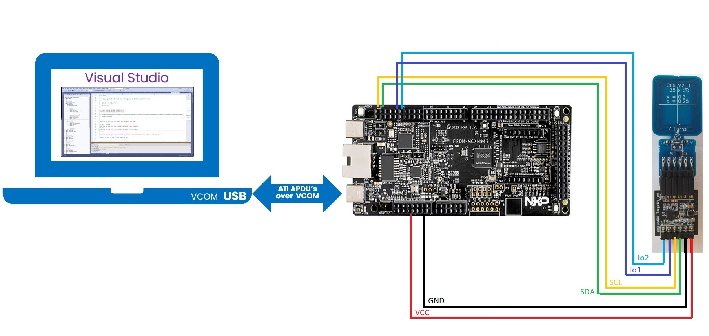
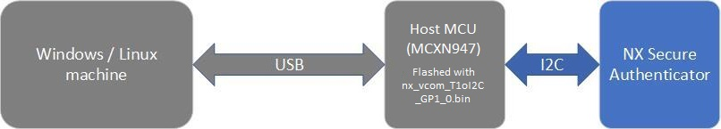
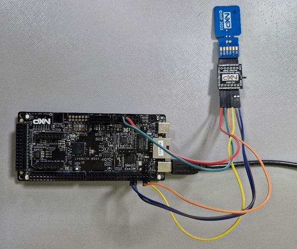
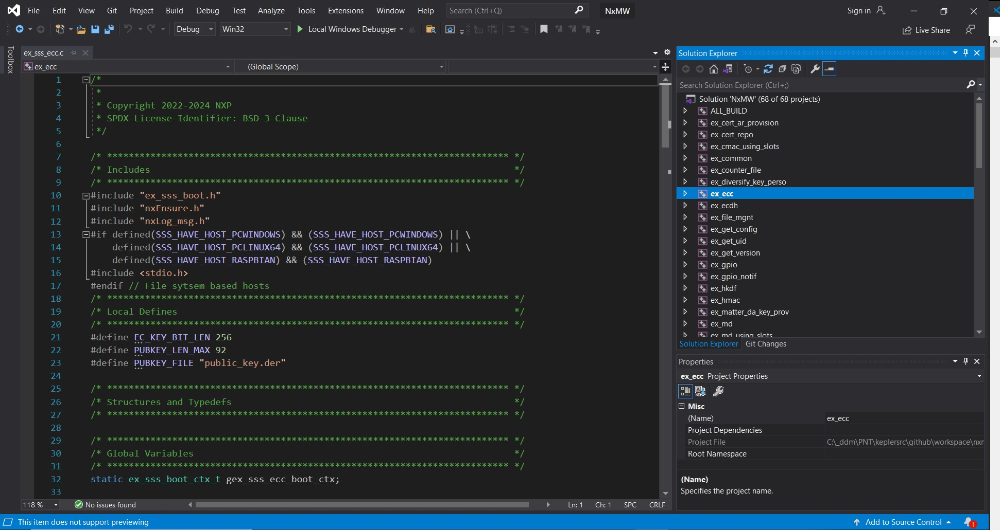
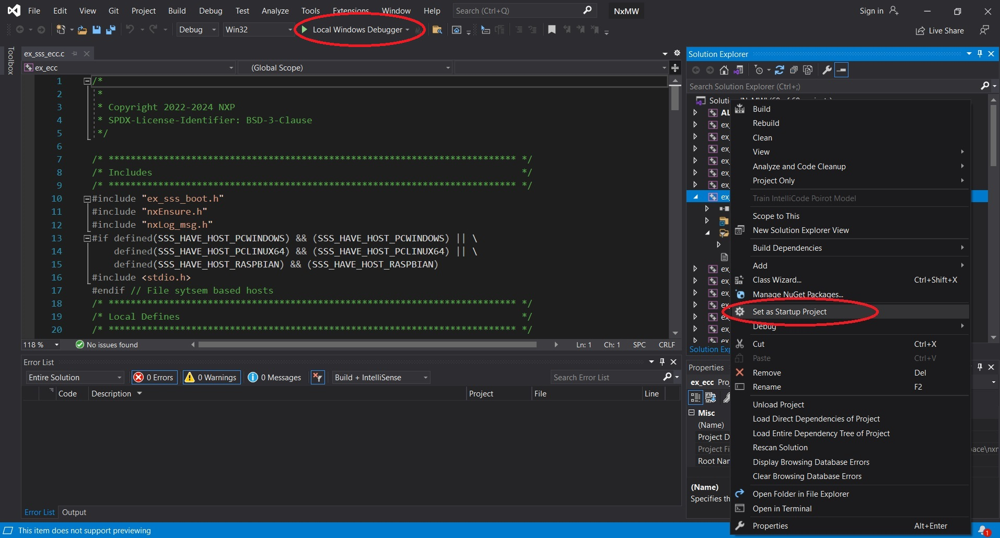
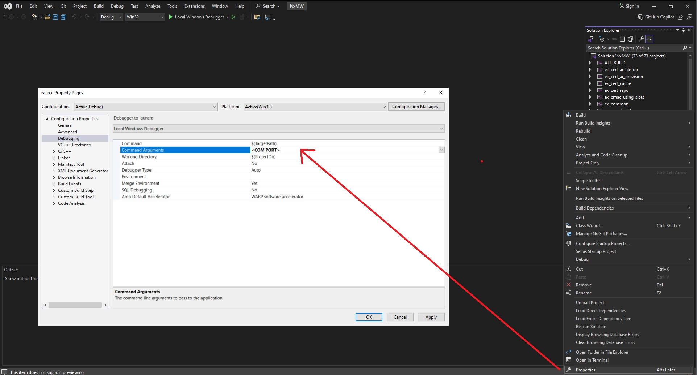

# Getting Started on Windows

Building the NX MW on Windows enables to explore the MW stack and
examples in a rich IDE. Only the low level communication (T=1oI2C) to
the Secure Authenticator is done on a connected host MCU as interface to the
Secure Authenticator.

>**Note:** FRDM-MCXN947 is used as an Host MCU example in the following documentation.



## Prerequisite

- Visual studio installed (\>= 2015 version, or higher)
- Python installed (version 3.10 or above). Please follow the guidelines at [Python Download](https://www.python.org/downloads/).
- Git installed. Please follow the guidelines at [git install](https://git-scm.com/downloads/win)
- West installed (version 1.2.0 or above). Please follow [west setup](https://docs.zephyrproject.org/latest/develop/west/install.html) to install west
- CMake installed (version 3.30.0 or above). Preferably at C:/opt/cmake/bin/cmake.exe


## Getting the NX Middleware Source

- Follow the following steps to create a new workspace which downloads the NX middleware and the required files.

```console
west init -m https://github.com/NXP/nxmw.git --mf mcu_sdk/west.yml workspace
OR
west init -m https://github.com/NXP/nxmw.git --mr <branch name> --mf mcu_sdk/west.yml workspace

cd workspace
west update
```

>**Note:** The complete setup takes 10-15 minutes to download. If network error occured, you will see a message update failed for project. Try `west update` again.

- Once downloaded you should have the NX middleware and all the required SDK files.

- If you have cloned the NX Middleware using git, and west setup is not done, you can follow the following steps

```console
cd nxmw
west init -l --mf mcu_sdk/west.yml
cd ..
west update
```

## Initial Setup

We use VCOM binary to achieve the low level communication (T=1oI2C) with
the Secure Authenticator. This binary acts like a bridge between the windows host and the Secure Authenticator.



- Secure authenticator connected to a Host (MCXN947/MCXA153/LPC55S69). Please follow the pin diagram as shown.



- Connect Host MCU-Link port to Windows USB port.

- Flash MCXN947 with vcom binary. You can use the MCUX project provided in `nxmw/mcux_project/mcxn947/vcom` OR Use the precompiled binaries in binary folder `nxmw/binaries/nx_vcom`.

- Now connect the other USB port of MCXN947 to the PC

- The MCXN device will appear as a USB serial device. Note the COM port
  number with which it is connected to.

## Create Build files

- Use `nxmw/scripts/create_cmake_projects.py` to generate the build files,

```console
cd nxmw\scripts
env_setup.bat
python create_cmake_projects.py
```


>**Note:** The env_setup.bat files defines the development tools environment. Depending on your tools (MCUXpresso, Visual Studio, Java, Python and CMake) file locations you may need to update the tools paths within the env_setup.bat file.


>**Note:** Use Command Prompt to generate build files. env_setup.bat file may not work correctly with PowerShell.

- Build files are generated at `nxmw_build/`

- Use the visual studio solution at `nxmw_build/se_x86/NxMW.sln` to build the required example.





- By default the cmake options are set as below.

```
   CMAKE_BUILD_TYPE:STRING=Debug
   CMAKE_CONFIGURATION_TYPES:STRING=Debug;Release;MinSizeRel;RelWithDebInfo
   CMAKE_INSTALL_PREFIX:PATH=C:/Program Files (x86)/NxMW
   NXMW_All_Auth_Code:STRING=Enabled
   NXMW_Auth:STRING=SYMM_Auth
   NXMW_Auth_Asymm_CA_Root_Key_Id:STRING=0
   NXMW_Auth_Asymm_Cert_Repo_Id:STRING=0
   NXMW_Auth_Asymm_Cert_SK_Id:STRING=0
   NXMW_Auth_Asymm_Host_Curve:STRING=NIST_P
   NXMW_Auth_Asymm_Host_PK_Cache:STRING=Enabled
   NXMW_Auth_Symm_App_Key_Id:STRING=0
   NXMW_Auth_Symm_Diversify:STRING=Disabled
   NXMW_CMSIS_Driver:STRING=Disabled
   NXMW_Host:STRING=PCWindows
   NXMW_HostCrypto:STRING=MBEDTLS
   NXMW_Log:STRING=Default
   NXMW_NX_Type:STRING=NX_R_DA
   NXMW_OpenSSL:STRING=1_1_1
   NXMW_RTOS:STRING=Default
   NXMW_SA_Type=A30
   NXMW_SMCOM:STRING=VCOM
   NXMW_Secure_Tunneling:STRING=NTAG_AES128_EV2
   NXPInternal:BOOL=ON
   NXTST_FTR_TEST_COUNT:BOOL=OFF
   WithCodeCoverage:BOOL=OFF
   WithSharedLIB:BOOL=OFF
```

- Change the cmake options if required using the command `cmake-gui .`. For more details refer [**CMake Options**](../config/readme.md)

>**Note:** The Sigma Verifier/Prover demo requires to run the Personalization example once first. Refer [**NX Personalization**](../../demos/nx/nx_Personalization/readme.md).


## Build / Run Examples

- To build the demo:

```console
cd nxmw_build/se_x86
cmake --build . --target <example_name>
```

- Run demo as :

```console
<example_name>.exe <COM_PORT>
```

- Debug demo
  - Set demo as startup project in Visual Studio and click on `Local Windows Debugger`




  - Ensure that the com port is set in command line arguments



