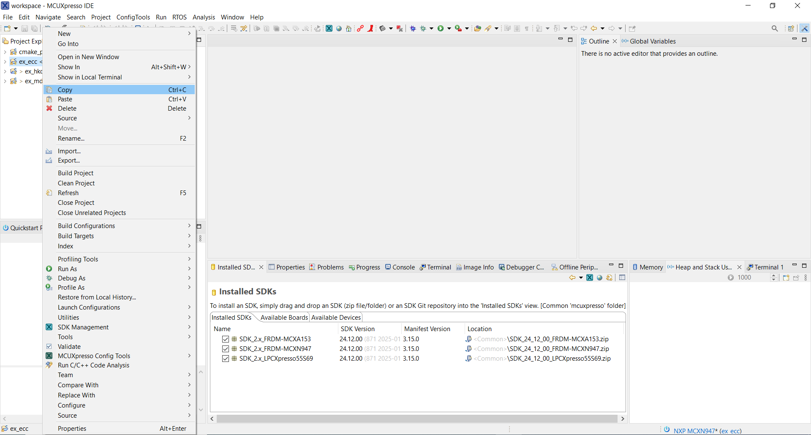
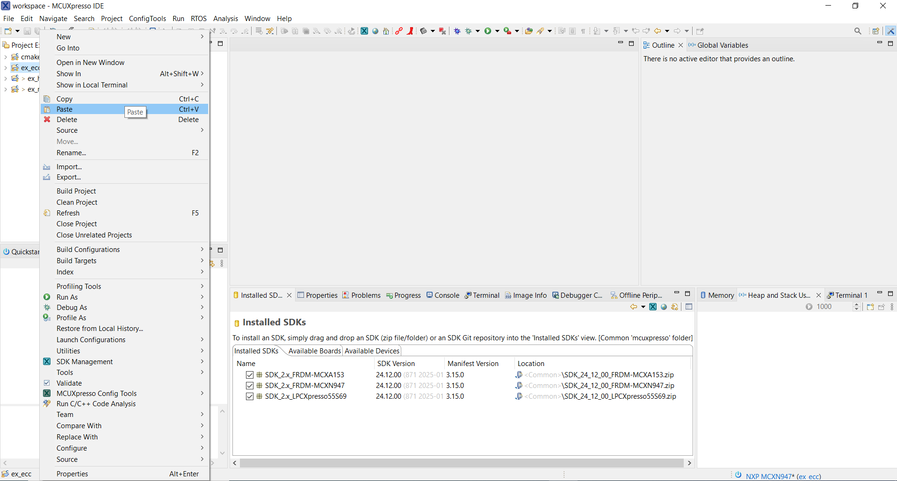
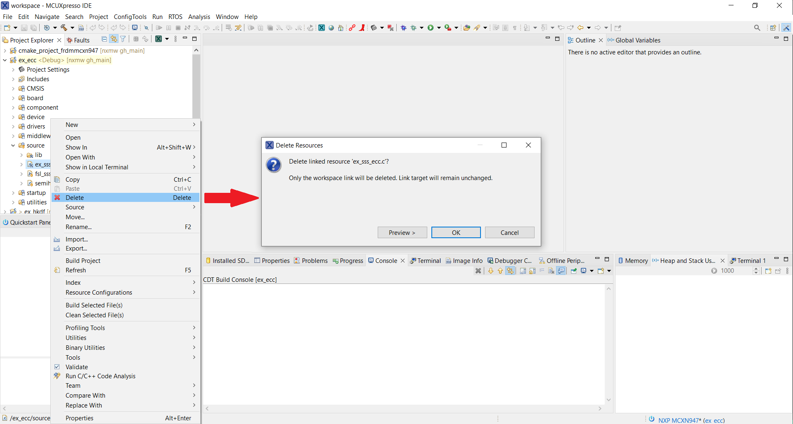
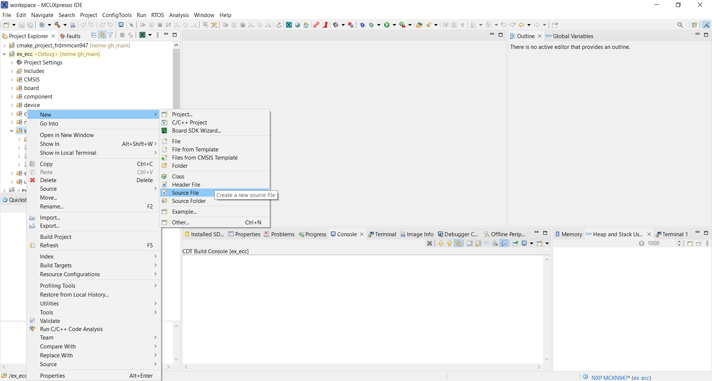

# MCUX Projects for NX SA

These projects demonstrate usage of MCUXpresso-IDE to build and run the demos. Projects for following boards are provided for reference:

- LPC55S69
- FRDM-MCXA153
- FRDM-MCXN947

This section will give a brief about the MCUX projects.

## About The MCUX Projects

Demos for the supported boards are provided in respective MCUX folders. Every project contains MCUXpresso supported projects which can be used to build and debug the demos. The project folder contains the feature file `fsl_sss_ftr.h` with the necessary configurations for building the project.

>**Note:** All files you see in the projects are links to the middleware files. They are not copies. Only the fsl_sss_ftr.h file is different for different projects.

>**Note:** All projects are linked to particular versions 3rd party softwares. Most demos are linked to mbedtls 2. To use mbedtls 3, you need to remove mbedtls 2 from the sources and add mbedtls 3. Only then the macros present in `fsl_sss_ftr.h` can be updated. 

For more information on the configurations (Refer: [**SA Configs**](../doc/config/readme.md)).

For building and running the projects, refer [**Getting Started on MCUs Using Standalone MCUXpresso Projects**](../doc/mcu_projects/readme.md).

For details of Memory Configurations of MCXA153, refer [**Memory Configs for MCXA153**](mcxa/README.md).

## Creating New Standalone Projects

The Standalone projects structure allows you to create copies of existing projects which can then be modified according to any application.

- Import a standalone project in MCUXpresso. Right click on the project and select Copy.

- Right click in the empty space and select Paste. You will see a copy project dialogue box.

- Enter a new project name. Ensure that Default Location is not selected. In location, create a new project folder (preferably with same name as project) and and select that location.

- You will now see the new project in project explorer.

- From the new project, delete the existing demo file.

- Right click on the source folder and add new source files.

For more information on writing own applications Refer: [**Write Own Applications**](../doc/stack/readme.md).