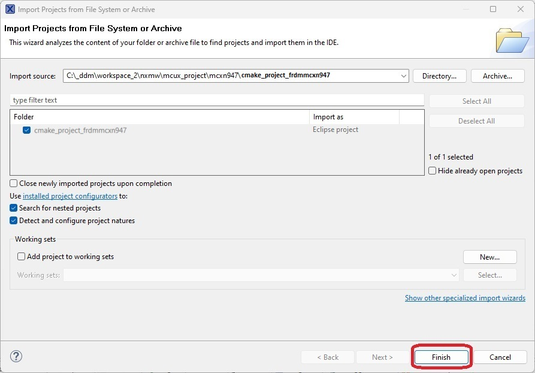

# MCUX Projects for NX SA

These projects demonstrate usage of MCUXpresso-IDE to build, run and debug the demos. Projects for following boards are provided for reference:

- LPC55S69
- FRDM-MCXA153
- FRDM-MCXN947

This section will give a brief about the CMake based projects.

## About The CMake Projects

- To open a project, go to **File** -> **Open Project from File System...**. In the dialog box that opens, click on **Directory...** and navigate to the target project in the folder corresponding to the required development board, select the required cmake project and click on **Select Folder**.

- To build any demo, Update the Makefile with the demo that you want to build.
    BUILD_TARGET=ex_ecc

- The build directory is mentioned in the Makefile.

- The process of Building and Debugging the project is same as that of the standalone projects.

- For more information on the configurations (Refer: [**SA Configs**](../doc/config/README.md)).

- For building and running the projects, refer [**Getting Started on MCUs Using Standalone MCUXpresso Projects**](../doc/mcu_projects/readme.md).

