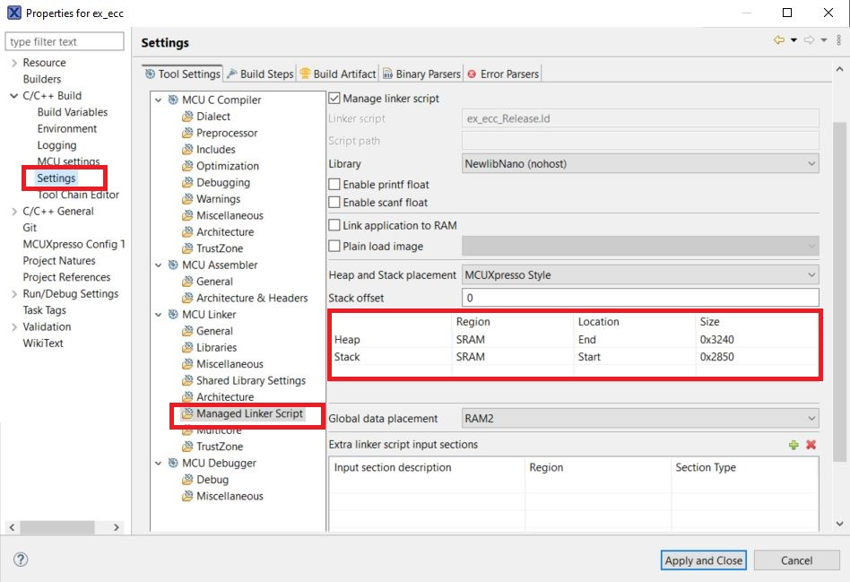

# MCUX Projects for NX SA based on MCXA-153

## Memory Configs MCUX Projects for MCXA153

FRDM-MCXA153 is lower power MCU based on Arm® Cortex® M33

It has up to 128KB flash with up to 32 kB RAM with 8kB ECC

Due to its low memory capacity, Memory Configuration may need an update in Memory Configuration of MCUXpresso.

To update the memory configurations,

1) Goto Project Properties->Settings->Managed Linker Scripts

2) Update the Heap and Stack Size

<p align=center>

</p>

```console

Recommended Stack and Heap Sizes
Symmentric Authentication
Heap  - 0x3000
Stack - 0x2800

Sigma Authentication
Heap  - 0x3240
Stack - 0x2850

```
