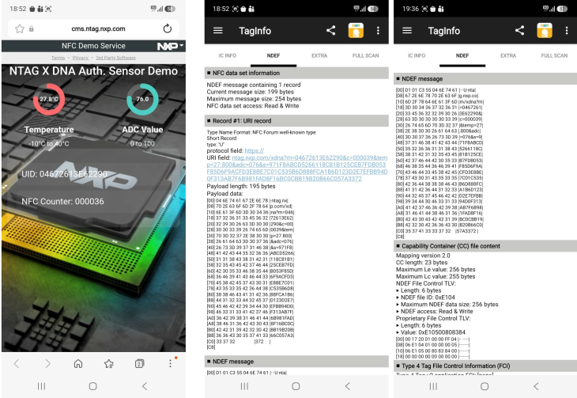
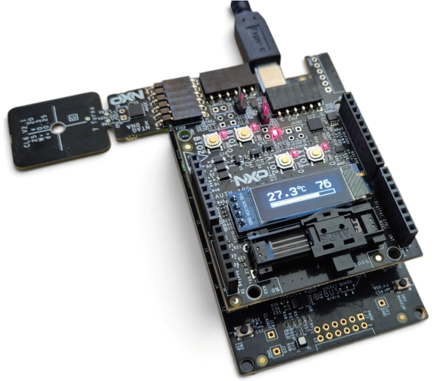

# NTAG X DNA AUTH-ARD Shield Trusted Sensor  Demo 
This MCUXpresso example project demonstrates:
- Reading the AUTH-ARD slider (ADC) value (simulating an analog sensor)
- Reading the AUTH-ARD temperature sensor value
- Displaying both sensor values on the AUTH-ARD OLED display
- NTAG X DNA trusted dynamic sensor readout via NFC phone (app-less)

  The NDEF file contains a link to the NTAG Web Service along the sensor data.
  
  Each time the NFC-enabled phone reads the NDEF file, the NDEF file is updated
  via the NTAG X DNA I2C interface with the latest sensor data to ensure that
  the phone receives up-to-date information. 
  
  Next, an ECC signature over the full NDEF data is computed using the NTAG X DNA SDM (Secure Dynamic Messaging).
  
  The NFC phone opens a NTAG Web Service link including sensor data and ECC signature
  in a browser. The service verifies the ECC signature generated by NTAG X DNA.
  
  It checks the tag UID, the SDM counter value (to prevent replay attacks), and the
  validity of the ECDSA Signature. After successful verification, the service displays
  authenticated sensor data on the phone.


 
## Required Hardware: 
 - FRDM-MCXA153
 - AUTH-ARD Shield
 
## Setup


 Further details on the AUTH-ARD Shield hardware, features, and configuration can be found in 
 UM12448 - AUTH-ARD Shield User Manual. 

## Pre-requisites
Before running this example, execute the "NTAG X DNA AUTH-ARD Shield Trusted Sensor Provisioning Demo" to perform the required NTAG X DNA configuration and provisioning.

<b>Note:</b><br>
The NTAG service requires each NTAG X DNA device to be registered before it can perform a signature verification. 

If the device is not registered, the service will return an error message.

The "NTAG X DNA AUTH-ARD Shield Trusted Sensor Provisioning Demo" displays the NTAG X DNA device UID and application certificate, both of which are required for device registration with the NTAG service.

To register an NTAG X DNA sample, please contact your local NXP support representative.

Alternatively, the NXP TagInfo app can be used to read and display URI records and the NDEF messages.

 
## Console output
If everything is successful, the output will be similar to:
```
nx_mw :WARN :mbedtls_entropy_func_3_X is a dummy implementation with hardcoded entropy. Mandatory to port it to the Micro Controller being used.
nx_mw :WARN :mbedtls_entropy_func_3_X is a dummy implementation with hardcoded entropy. Mandatory to port it to the Micro Controller being used.
nx_mw :INFO :cip (Len=22)
                01 04 63 07     00 93 02 08     00 02 03 E8     00 01 00 64 
                04 03 E8 00     FE 00 
nx_mw :INFO :Session Open Succeed
nx_mw :INFO :Ndef File:  (Len=256)
                00 C7 D1 01     C3 55 04 6E     74 61 67 2E     6E 78 70 2E 
                63 6F 6D 2F     78 64 6E 61     3F 6D 3D 30     34 42 45 33 
                38 42 41 44     37 31 45 39     30 26 63 3D     30 30 30 30 
                32 35 26 74     65 6D 70 3D     32 39 2E 33     30 30 26 61 
                64 63 3D 30     38 31 26 73     3D 36 30 34     34 33 36 43 
                34 32 30 36     43 46 32 45     30 31 30 33     35 37 37 43 
                35 31 30 37     30 39 31 43     38 36 46 44     38 35 42 42 
                33 32 30 41     41 32 46 35     37 43 45 42     37 30 38 41 
                32 32 30 31     42 38 35 46     35 36 45 31     39 33 44 38 
                33 33 30 38     30 30 45 42     44 32 35 43     33 32 43 44 
                36 35 41 30     44 39 32 32     43 39 37 35     42 36 35 43 
                32 42 42 39     38 39 34 34     44 37 38 41     42 35 31 44 
                39 36 37 37     41 30 37 30     33 00 00 00     00 00 00 00 
                00 00 00 00     00 00 00 00     00 00 00 00     00 00 00 00 
                00 00 00 00     00 00 00 00     00 00 00 00     00 00 00 00 
                00 00 00 00     00 00 00 00     00 00 00 00     00 00 00 00 
nx_mw :WARN :mbedtls_entropy_func_3_X is a dummy implementation with hardcoded entropy. Mandatory to port it to the Micro Controller being used.
nx_mw :WARN :mbedtls_entropy_func_3_X is a dummy implementation with hardcoded entropy. Mandatory to port it to the Micro Controller being used.
nx_mw :INFO :cip (Len=22)
                01 04 63 07     00 93 02 08     00 02 03 E8     00 01 00 64 
                04 03 E8 00     FE 00 
nx_mw :INFO :Session Open Succeed
nx_mw :INFO :Update NDEF file Success !!!...

```