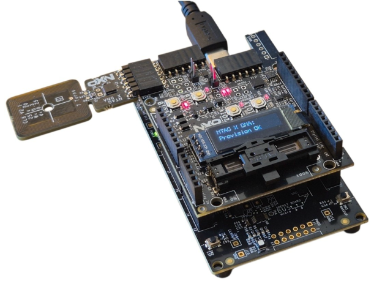

# NTAG X DNA AUTH-ARD Shield Trusted Sensor Provisioning Demo 
This MCUXpresso example project provisions an NTAG X DNA tag to support the NTAG X DNA AUTH-ARD Shield Sensor Demo.

 The provisioning sequence performed by this example:
 - Opens a symmetric authenticated session with the NTAG X DNA.
 - Updates the ECC key policy to enable ECC-based SDM signing.
 - Builds and writes an NDEF URI record containing SDM mirror token placeholders for UID, read counter, and signature.
 - Configures the NDEF file SDM settings, including mirror offsets for UID, read counter, and signature fields.
 - Updates the CC file to grant read/write access.
 - Configures GPIO2 in NfcPausefileOut mode to allow the host MCU to update sensor data before the tag responds.
 - Reads and logs the device UID for NTAG service registration.
 - Reads and logs the application certificate for NTAG service registration.
 - Closes the authenticated session.

 Provisioning result is displayed on the AUTH-ARD OLED screen.

 **Warning**
 This example is only for demonstration purpose. Maintaining and 
 provisioning the keys/files should be done in a secure way.
 
## Required Hardware: 
 - FRDM-MCXA153
 - AUTH-ARD Shield
 
## Setup


 Further details on the AUTH-ARD Shield hardware, features, and configuration can be found in 
 UM12448 - AUTH-ARD Shield User Manual. 
 
## Console output
 
If everything is successful, the output will be similar to:
```
nx_mw :WARN :mbedtls_entropy_func_3_X is a dummy implementation with hardcoded entropy. Mandatory to port it to the Micro Controller being used.
nx_mw :INFO :cip (Len=22)
                01 04 63 07     00 93 02 08     00 02 03 E8     00 01 00 64 
                04 03 E8 00     FE 00 
nx_mw :INFO :Session Open Succeed
nx_mw :INFO :Update the KeyPolicy of the NXP pre-provisioned application EC-key to enable ECC-based Secure Dynamic Messaging
nx_mw :INFO :NDEF File (Len=256)
                00 C7 D1 01     C3 55 04 6E     74 61 67 2E     6E 78 70 2E 
                63 6F 6D 2F     78 64 6E 61     3F 6D 3D 30     34 42 45 33 
                38 42 41 44     37 31 45 39     30 26 63 3D     30 30 30 30 
                32 35 26 74     65 6D 70 3D     32 36 2E 34     30 30 26 61 
                64 63 3D 30     38 31 26 73     3D 36 30 34     34 33 36 43 
                34 32 30 36     43 46 32 45     30 31 30 33     35 37 37 43 
                35 31 30 37     30 39 31 43     38 36 46 44     38 35 42 42 
                33 32 30 41     41 32 46 35     37 43 45 42     37 30 38 41 
                32 32 30 31     42 38 35 46     35 36 45 31     39 33 44 38 
                33 33 30 38     30 30 45 42     44 32 35 43     33 32 43 44 
                36 35 41 30     44 39 32 32     43 39 37 35     42 36 35 43 
                32 42 42 39     38 39 34 34     44 37 38 41     42 35 31 44 
                39 36 37 37     41 30 37 30     33 00 00 00     00 00 00 00 
                00 00 00 00     00 00 00 00     00 00 00 00     00 00 00 00 
                00 00 00 00     00 00 00 00     00 00 00 00     00 00 00 00 
                00 00 00 00     00 00 00 00     00 00 00 00     00 00 00 00 
nx_mw :INFO :NDEF file: SDM UID offset: 28 (0x1C)
nx_mw :INFO :NDEF file: SDM read counter offset: 45 (0x2D)
nx_mw :INFO :NDEF file: NDEF file signature offset: 74 (0x4A)
nx_mw :INFO :Update NDEF-file settings (file ID = 2)
nx_mw :INFO :Update NDEF file content (LEN + NDEF message)
nx_mw :INFO :NDEF URL (without URI Identifier): ntag.nxp.com/xdna?m=04BE38BAD71E90&c=000025&temp=26.400&adc=081&s=604436C4206CF2E0103577C5107091C86FD85BB320AA2F57CEB708A2201B85F56E193D8330800EBD25C32CD65A0D922C975B65C2BB98944D78AB51D9677A0703 

nx_mw :INFO :CC-file: Change Read-Only access rights file to R/W.
nx_mw :INFO :Configure GPIO2: Enable NfcPausefileOut.
nx_mw :INFO :==================================================================
nx_mw :INFO : PLEASE provide the UID for NTAG service registration             
nx_mw :INFO :==================================================================
nx_mw :INFO :Device UID: 0x (Len=7)
                04 AC 4D BA     D7 1E 90 
nx_mw :INFO :==========================================================================
nx_mw :INFO : PLEASE provide the application certificte. for NTAG service registration 
nx_mw :INFO :==========================================================================
nx_mw :INFO :Application certificate:  (Len=367)
                7F 21 82 01     6A 30 82 01     66 30 82 01     0B A0 03 02 
                01 02 02 07     04 AC 4D BA     D7 1E 90 30     0A 06 08 2A 
                86 48 CE 3D     04 03 02 30     46 31 0C 30     0A 06 03 55 
                04 0A 0C 03     4E 58 50 31     1D 30 1B 06     03 55 04 03 
                0C 14 4E 58     50 20 41 75     74 68 20 52     6F 6F 74 43 
                41 76 45 32     30 31 31 17     30 15 06 03     55 04 05 13 
                0E 36 33 37     30 39 33 32     30 31 30 31     30 30 31 30 
                1E 17 0D 32     34 31 30 30     32 30 30 30     30 30 30 5A 
                17 0D 34 34     31 30 30 32     30 30 30 30     30 30 5A 30 
                2C 31 17 30     15 06 03 55     04 0D 0C 0E     30 34 41 30 
                30 30 30 34     30 31 30 30     30 31 31 11     30 0F 06 03 
                55 04 2D 03     08 00 04 AC     4D BA D7 1E     90 30 59 30 
                13 06 07 2A     86 48 CE 3D     02 01 06 08     2A 86 48 CE 
                3D 03 01 07     03 42 00 04     BD D4 77 62     CE 1E 6C 3D 
                89 1A 68 7A     9E 3E D1 86     FC E9 21 D9     8F D5 50 40 
                10 6F 6C D7     34 42 3D CC     94 BA 0E F8     C1 CD 6D B3 
                E9 B1 48 2E     8F 2D BF CA     92 EA 2D 81     97 37 D7 1F 
                3B 1D 7D 5C     83 BE 3F 01     30 0A 06 08     2A 86 48 CE 
                3D 04 03 02     03 49 00 30     46 02 21 00     BE F0 79 69 
                E6 0B 35 68     CE 0C D0 53     96 C9 38 91     72 F1 C0 3D 
                C1 6A 03 AB     55 78 F0 87     1E A8 EF 15     02 21 00 BE 
                A3 8F 38 F2     80 16 BA 93     81 D1 8B F3     54 41 1A 0E 
                2F FD 67 A8     A1 1D 00 F0     D2 7C 21 98     16 BA 20 
nx_mw :INFO :NTAG X DNA AUTH-ARD Shield Trusted Sensor Provisioning Demo Success !!!...
```